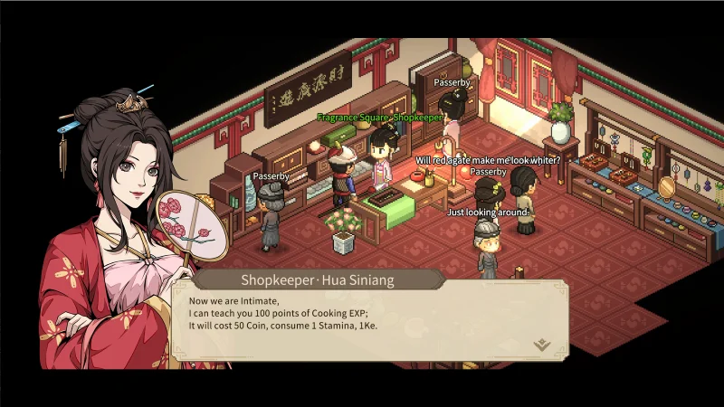
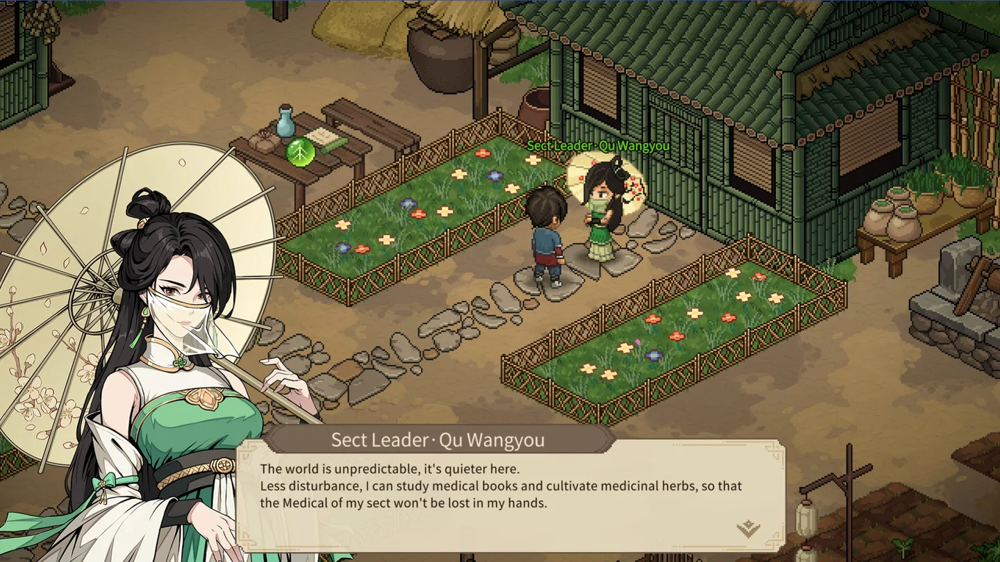
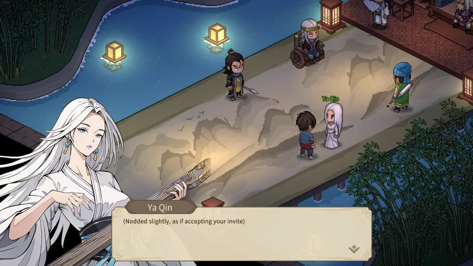

Mấy ông nghe tin gì chưa? Trong _Hero's Adventure_ (Đại Hiệp Lập Chí Truyện), anh em có thể kết duyên với tới **25 nhân vật nữ**. Nghe thì sướng, nhưng mỗi người một kiểu: có người chỉ cần đủ hảo cảm và một viên đá, có người kéo theo cả chuỗi nhiệm vụ dài, có người lỡ đúng một lựa chọn là mất luôn. Bài này Cenix soạn lại từ bảng hướng dẫn của cộng đồng người chơi Việt, kèm thứ tự nên tán để không ai bị khóa mất.

## Luật chơi cơ bản của Nguyệt Lão

-   **Mở Nguyệt Lão Từ**: ban ngày dẫn một nhân vật nữ đã đủ **100 hảo cảm** vào Bạch Vân quán ở Sở Tương thành. Miếu Nguyệt Lão nằm ngoài bản đồ, kế bên Sở Tương thành.
    
-   **Hai kiểu kết duyên**: một là dẫn **đúng một** người nữ 100 hảo cảm vào miếu và tốn **1 Tam Sinh Thạch**, hai là đi hết sự kiện cốt truyện của người đó, tới cuối là tự kết duyên.
    
-   **Tam Sinh Thạch** lấy ở: mật thất nhà trưởng làng Vô Danh, đấu giá ở Châu Quang Bảo Khí Lâu (có lúc ra), mua ở Thông Thiên tháp, rương trong ngôi nhà kế hàng thịt Đại Lương, rương sau lưng Mạn Đà La ở Quỳnh Hoa Cốc, kệ Trân Phẩm Các ở Lâm An, mời Nghiêm Như Nhị vào đội, quan tài đá trong Mang Sơn huyệt (khi không hợp tác với Mô Kim Môn), và cạnh cây đàn góc phải trong Diệu Âm Phường.
    
-   Dẫn **5 người đã kết duyên** vào miếu sẽ có sự kiện đặc biệt. Đủ **25 người** rồi thì nói chuyện với cô bé đội nón gấu trong miếu để mở tương tác mới.
    

<strong>Muốn cưới đủ 25 người:</strong> <strong>không</strong> vào Cửu Lưu Môn và <strong>không</strong> theo Yên quân. Nếu bái sư đầu làng thì nên rời môn sau khi chữa thương cho sư phụ ở Bất Lão Tuyền hoặc cứu Sở Cuồng Sinh, vì làm tới hết sự kiện đánh Cửu Lưu Môn là không rời môn được nữa. Nhận làm các chủ Lang Gia Kiếm Các đời sau thì Kiếm Si không cho rời môn, nhưng nhận nhiệm vụ tìm Sở Cuồng Sinh của Phó Dao Cầm thì vẫn rời được.

## Thứ tự kết duyên nên theo

| # | Nhân vật | Lưu ý quan trọng |
|---|---|---|
| 1 | Mạn Đà La | Phải là người kết duyên **đầu tiên** mới có kỹ năng tình duyên |
| 2 | Hoa Tứ Nương | Đã kết duyên mà để chung đội với Mật Thám thì hắn bỏ đi |
| 3 | Lạc Thiên Tuyết | Cần vào Thần Bộ Môn, nên kết duyên trước khi rời môn |
| 4 | Hoa Thanh Thanh | Cần vào Yến Tử Ổ |
| 5 | Diệp Ngân Bình | Phải làm chuẩn các sự kiện gặp mặt |
| 6 | Định Hải Đường | Cần vào Cửu Giang Thủy Trại, xong trước khi Khang vương đăng cơ |
| 7 | Khúc Vong Ưu | Mời trước khi sự kiện Phù Đồ Tự kích hoạt |
| 8 | Giáng Tử Yên | Cửu Lê chưa diệt thì bị phục kích gần Đạo Huyền Tông |
| 9 | Lăng Mộng Điệp | Cần Khúc Vong Ưu trong đội |
| 10 | Hàn Hồng Ngọc | Dẫn cô ấy đi gặp hoàng đế bị giam trong doanh trại Yên quân |
| 11 | Phúc Tinh quận chúa | Thắng tỷ võ kén chồng, trước khi Khang vương đăng cơ |
| 12 | Nhất Chi Hoa | Đi dạo với Liễu Nguyệt Anh trước khi nhận vụ đánh bạc ở Lâm An |
| 13 | Ách Cầm | Phải làm sự kiện gia nhập Nho Thánh Quán |
| 14 | Hoàn Nhan Chiêu Ninh | Gặp ở dấu ! trên bản đồ trước khi diệt Yên quân |
| 15 | Nghiêm Như Nhị | Giải xong câu đố Quần Phương Quán, tới điểm hẹn đúng giờ |
| 16 | Miêu Thải Điệp | Muốn xóa 2 debuff cho Ngư Vi Nhi thì kết duyên **sau** khi cứu Ngư Vi Nhi |
| 17 | Cố Khuynh Thành | Nội lực từ 1000 hoặc âm luật trên 60 để lấy cây đàn tím |
| 18 | Ngư Vi Nhi | Không nhận đưa thư cho tộc trưởng Cửu Lê |
| 19 | Phó Dao Cầm | 100 hảo cảm, làm nhiệm vụ tìm Sở Cuồng Sinh |
| 20 | Đường Uyển Nhi | Chọn đúng câu ở Hoa Hải |
| 21 | Hải Đường Thu | Có thể làm Phượng Tuyền Cơ trước, chuỗi đó làm luôn phần của cô ấy |
| 22 | Phượng Tuyền Cơ | Nửa đêm ra ngoài trò chuyện với cô ấy |
| 23 | Đinh tiểu thư | Cưới trước khi làm nhiệm vụ Thanh Phong Trại |
| 24 | Liễu Nguyệt Anh (Tsukuyo Anh Vũ) | Phải dẫn đi dạo Đại Lương thành |
| 25 | Kỷ Phục Linh | Phải làm trước khi diệt Yên quân |

## Vùng làng Vô Danh và các thành

### Hoa Tứ Nương — chủ quán trọ làng Vô Danh

Kết duyên bằng **Tam Sinh Thạch**, phải làm **trước khi Khang vương đăng cơ**.

1.  Vào quán trọ khoảng 6 giờ sáng đến 12 giờ trưa sẽ gặp kẻ côn đồ: trả 500 xu (+5 trí tuệ), đánh nhau (+2 dũng khí), hoặc làm ngơ (**-30 hảo cảm** Hoa Tứ Nương).
    
2.  Nhận nhiệm vụ của cô ấy, ra rồi vào lại quán trọ từ 12 giờ đêm tới 5 giờ sáng.
    
3.  Mời cô ấy theo, tới 1 trong 3 thành dò tin: Lâm An thì thắng giải ở đấu trường ngầm, Sở Tương thì thành vua chọi gà trước cửa Đinh gia, Đại Lương thì trả tiểu nhị khách sạn 10 bạc.
    
4.  Tới sòng bạc hỏi thăm, chọn đánh bạc hoặc đánh nhau (nên chọn đánh bạc).
    
5.  Vào phủ Khang vương ở Lâm An, đi phòng bên trái, đánh với hôn phu cũ của cô ấy (đã làm phò mã với Phúc Tinh quận chúa thì bỏ qua bước này).
    
6.  Thắng xong nên chọn **để Khang vương quyết định** để tăng hảo cảm với Khang vương, các lựa chọn khác đều trừ.
    
7.  Kết duyên ở miếu Nguyệt Lão.
    

_Bà chủ quán vừa nấu ngon, vừa dạy nghề bếp, lại còn đánh lưu manh giỏi. Chốt đơn._

<strong>Cảnh báo:</strong> để Mật Thám chung đội với Hoa Tứ Nương là hắn bỏ đi mãi mãi. Nếu hảo cảm với Hoa Tứ Nương tụt dưới 20, hắn quay lại đánh anh em: thắng thì hắn đi luôn, thua thì hắn bám theo thành thiên phú "Tình Chi Hộ Thủ", xuất hiện mỗi khi tới lượt Hoa Tứ Nương.

### Diệp Ngân Bình — con gái Diệp nguyên soái

Kết duyên bằng **Tam Sinh Thạch**, làm **trước khi Khang vương đăng cơ**.

1.  Ban ngày tới Thập Tự Pha gặp và cùng chiến đấu (ra ngã ba đường tìm, hoặc hỏi Mật Thám).
    
2.  Gặp lại ở quán trọ Hoa Tứ Nương, trả tiền cơm giúp để nhận trang sức tím.
    
3.  Gặp lại ở 3 thành: Đại Lương thì vào nha môn phá án (cho hai bên chạy đua, thủ phạm là thằng họ Lý), Lâm An thì giúp bắt trộm trên cây cầu gần Miếu Hoang, Sở Tương thì vô địch anh hùng hội (danh vọng 3 trở lên) rồi ra ngoài thắng cô ấy thách đấu.
    
4.  Tới dấu ! gần Đạo Huyền Tông, rồi tới Diệp Gia Quân mời cô ấy và kết duyên ở miếu.
    
5.  **Sau kết duyên**: tới Hoàng Mộc Cảng vào chợ để kích hoạt sự kiện, vào võ quán so tài, nhận **+2 ngộ tính, +2 lực tay** và 1 thiên phú vàng.
    

### Lạc Thiên Tuyết và Hoa Thanh Thanh — hai cô gái mở màn

**Lạc Thiên Tuyết** (Tam Sinh Thạch): vào **Thần Bộ Môn**, tăng hảo cảm 100, kết duyên ở miếu. Nên kết duyên trước khi rời môn. Sau này nếu làm 10 lần nhiệm vụ cướp ngục Thần Bộ Môn để mời Bộ Tuyệt Trần thì nhớ giữ cô ấy trong đội, không thì cô ấy nhảy ra đánh tới chết.

**Hoa Thanh Thanh** (Tam Sinh Thạch): vào **Yến Tử Ổ**, tăng hảo cảm 100. Lúc trò chuyện chọn đánh (phải để cô ấy **thắng**) hoặc nói chuyện (cần khẩu tài cấp 3). Năng lực ám lấy từ cấp 3 trở lên, rồi kết duyên ở miếu.

<strong>Phần thưởng sau kết duyên:</strong> dẫn từng cô đi một vòng các địa điểm là được <strong>+1 phúc duyên, +1 ngộ tính</strong> và <strong>1 tuyệt kỹ lam</strong>. Lạc Thiên Tuyết: Yến Tử Ổ, Phồn Hoa Tự Cẩm Lâu, Thái Học Quán, Quần Phương Quán, phủ Lữ tướng quân, Tạng Nhai, lưu dân doanh, tượng đại anh hùng, bãi tha ma. Hoa Thanh Thanh: Thần Bộ Môn, Phồn Hoa Tự Cẩm Lâu, Thái Học Quán, tượng đại anh hùng, phủ Lữ tướng quân, Tạng Nhai, lưu dân doanh, bãi tha ma, Trân Phẩm Các.

### Giáng Tử Yên — khách lạ ở Sở Tương

Kết duyên bằng **Tam Sinh Thạch**.

1.  Ngủ ở quán trọ Sở Tương, xuống lầu sẽ gặp cô ấy. Trò chuyện thì chọn đánh, hoặc uống trà (cần điểm độc thuật).
    
2.  Trận với Cửu Lê: "Mình tao chấp hết" được +5 dũng khí, "Anh em tao chấp hết" được +5 trí tuệ và trang sức tím. **Chạy trốn là cô ấy biến mất mãi mãi.**
    
3.  Nếu chưa diệt Cửu Lê thì đi gần Đạo Huyền Tông sẽ bị phục kích và tụt quan hệ với Cửu Lê.
    
4.  Kết duyên ở miếu. Sau đó cần **65 độc thuật** để kích sự kiện Âm Liệt Như Độc: phục hồi bí kíp sư phụ để lại. Đốt bí kíp được thiên phú **Độc Ra Lục Phủ**, giữ lại được nội công cam **Tuyệt Độc Tàn Thiên**.
    

### Đinh tiểu thư — ở rể nhà giàu

Kết duyên theo sự kiện, phải làm **trước khi vào Thanh Phong Trại**. Tăng hảo cảm với Đinh lão gia lên 100, danh vọng từ 4 sẽ được mời ở rể. Đồng ý là cưới, nhưng dính debuff **máu cỗ Đinh gia**: mỗi nhân vật nữ trong đội làm anh em mất 10% máu tối đa mỗi lượt. Nhờ Miêu Thải Điệp giải được (cô ấy không được đang ở gia viên). Mỗi ngày vào nói chuyện mà không dẫn nữ nhân nào theo, Đinh tiểu thư sẽ cho đồ.

### Phúc Tinh quận chúa và Nhất Chi Hoa — chuyện ở Đại Lương

**Phúc Tinh quận chúa** (theo sự kiện, trước khi Khang vương đăng cơ):

1.  Đánh lôi đài tới giải cấp Địa sẽ gặp sự kiện **tỷ võ kén chồng**. Thắng hết các trận, cần **10 lực tay hoặc 10 thể chất** để chịu nổi cú đấm của cô ấy. Phí cưới 20 xâu.
    
2.  Bị bắt về phủ Khang vương, phải leo lên **tầng 6 Khai Hóa tháp** lấy ấn (thua là tháp đóng luôn).
    
3.  Đưa ấn xong chọn kết hôn. Được buff **Hoàng Thất Phò Mã**: mỗi ngày 20 xâu, nhưng tặng quà cho nhân vật nữ khác bị giảm 90% hảo cảm. Dẫn cô ấy tới miếu Nguyệt Lão được thêm **+2 phúc duyên**.
    

**Nhất Chi Hoa** (theo sự kiện, gặp ở sòng bạc Đại Lương):

1.  Hảo cảm trên 60 và đánh bạc thắng cô ấy. 5 ngày sau cô ấy nhờ anh em đi đánh bạc ở Lâm An, tới đó thắng hết là mời được vào đội.
    
2.  Giảm quan hệ với Tề vương hoặc tăng quan hệ với Khang vương để kích sự kiện ám sát. Ra bản đồ lớn cô ấy sẽ tấn công anh em, chọn **tha** cho cô ấy.
    
3.  Thề bảo vệ cô ấy cả đời và thắng trận khi tên thái giám kéo tới là kết duyên.
    

<strong>Cảnh báo:</strong> nhận vụ đánh bạc sinh tử ở Lâm An mà chưa làm sự kiện dẫn Liễu Nguyệt Anh đi dạo Đại Lương là mất cơ hội với Liễu Nguyệt Anh.

### Liễu Nguyệt Anh (Tsukuyo Anh Vũ) — chuỗi dài nhất game

Kết duyên theo sự kiện, xuất hiện khi anh em từ **cấp 20**.

1.  Cứu cô ấy khỏi 4 tên côn đồ ở góc trái Đại Lương thành.
    
2.  Dẫn đi dạo thành (**trước** vụ đánh bạc của Nhất Chi Hoa): xem trát xử trảm ở nha môn, Châu Quang Bảo Khí Lâu, Phồn Hoa Tự Cẩm Lâu, tìm người thân cho đứa trẻ gần Vân La Phường (bà lão chạy siêu nhanh), Bảo Quốc Tự, rồi xuống dưới Lưu Hương Phường chỗ mấy chiếc thuyền tìm trang sức.
    
3.  Tới Cửu Lê Bộ Lạc, ra sau tượng thần bên phải lấy **ngọc ấn**. Đánh với cô ấy: đưa ngọc ấn thì nhận công pháp chủy thủ cam, từ chối là hết chuỗi.
    
4.  Tới Trà Than gặp lại, đi tìm đủ 3 cái ấn, lên tàu tới Tỳ Phù thành, về Lâm An tìm ở Nhân Ái Đường và Vân Lâm Tự để nhận lại 3 ấn (đã ghép thành ngọc tỷ thì nhận ngọc tỷ).
    
5.  Khi có **danh vọng 8**, đã diệt Cửu Lưu Môn và có ít nhất 2 người đã kết duyên ở gia viên: dẫn cô ấy vào gia viên tìm ninja ở các phòng, tới bến tàu Lâm An để cô ấy rời đi.
    
6.  Đi Cấm Dương quan làm hết sự kiện Yên Vân, về Trung Nguyên, tới Lăng Tuyết sơn trang chọn **"người muốn dắt tay cả đời"**, sang Tỳ Phù thành làm hết sự kiện, lấy cây đao ở Băng Tâm hồ rồi về giải tán Tỳ Phù thành.
    
7.  Khi cô ấy hỏi có muốn gắn bó thật không thì đồng ý là kết duyên.
    

### Kỷ Phục Linh — tiểu thư Kỷ phủ

Kết duyên theo sự kiện. **Không** vào Yên quân hay Cửu Lưu Môn, và phải làm **trước khi diệt Yên quân**.

1.  Vào Đại Lương thành gặp sự kiện xử trảm, vào khách sạn nghe tin, **giờ Tý** tới nha môn giúp Kỷ Phục Linh.
    
2.  Ra Vùng Hoang Vu, chọn ở lại bảo vệ. Khi cô ấy trúng độc, chọn truyền nội lực (mất 250 nội lực tối đa).
    
3.  Về Kỷ phủ tìm **6 hạt châu**: xích đu, cái cây gần xích đu, bàn cờ vây ở lối vào; lu nước góc trái sân trong; tủ dưới cửa sổ và tủ sách bên trái trong nhà bên trái. Bấm cây đèn để vào mật thất.
    
4.  Dẫn cô ấy tới Tề phủ, cày cấp trên 50 để cô ấy solo Tề vương. Đi bản đồ sẽ gặp 3 trận, thắng nhận tuyệt kỹ cho cô ấy. Tới Lang Gia Kiếm Các đánh nhận chủy thủ cam, tới Diệu Âm Phường đánh nhận nội công cam, hạ Tề vương nhận võ công chủy thủ cam.
    
5.  Chờ 1 ngày, vào Tề phủ bắt đầu chuỗi Yên quân công thành. Thắng là kết duyên.
    
6.  **Sau kết duyên**: chào Kỷ đại nhân, tới Họa La Hiên (Lâm An) may đồ cưới. Hai nguyên liệu còn thiếu đi đấu giá ở Dạ Ma Phường, đủ thì nhận áo cam.
    

## Vùng Ngô Việt và Lâm An

### Khúc Vong Ưu — chưởng môn Thảo Mộc Môn

Kết duyên bằng **Tam Sinh Thạch**, phải làm **trước khi sự kiện Phù Đồ Tự kích hoạt**.

1.  Lần đầu gặp mà nhân đức 100 thì được **+50 y thuật**.
    
2.  Ra khỏi Thảo Mộc Môn rồi quay lại để mở sự kiện chữa bệnh. Muốn chữa hết mọi bệnh nhân, đội cần có: 50 kiếm, 8 lực tay, 800 nội lực, 50 độc thuật và món **Lôi Kích Mộc**. Chữa hết thì cô ấy có tuyệt kỹ cam hồi 25% máu tối đa.
    
3.  Đánh với Tà lang trung và đám bệnh nhân bị khống chế: giết thì solo luôn, tha thì sau sẽ gặp lại trên bản đồ và đánh chết.
    
4.  Kết duyên ở miếu.
    

_Chưởng môn Thảo Mộc Môn: chữa bệnh giỏi, cưới về thì khỏi lo thuốc men._

<strong>Lưu ý:</strong> vào Cửu Lưu Môn là không cưới và không mở được sự kiện chữa bệnh. Mẹo gỡ: đánh Đại Vương Trại vào cuối ngày thứ 3, rồi qua Thảo Mộc Môn kích sự kiện chữa bệnh vào ngày thứ 4 và quay lại.

### Mạn Đà La — người nên cưới đầu tiên

Kết duyên bằng **Tam Sinh Thạch**.

1.  Trả 10 xâu cho khách trong khách sạn Lâm An để biết Quỳnh Hoa Cốc, hoặc bái sư đầu làng và đạt cấp 30.
    
2.  Gặp cô ấy, khi bị hỏi thì chọn **ĐẸP**. Đánh với cô ấy, rồi đánh với quan binh.
    
3.  Mời vào đội khi **tín dụng trên 80**, kết duyên ở miếu. Khi được hỏi có bao nhiêu hồng nhan thì **nói thật**.
    
4.  **Sau kết duyên**: dẫn về thăm quê Tây Vực rồi quay lại Quỳnh Hoa Cốc, được **+2 ngộ tính, +1 lực tay** và 1 thiên phú cam. Có cô ấy trong đội là tự băng qua sa mạc tới khách sạn Trường An.
    

### Nghiêm Như Nhị — ca kỹ Quần Phương Quán

Kết duyên bằng **Tam Sinh Thạch**.

1.  Giải câu đố Quần Phương Quán (xem phần Cố Khuynh Thành bên dưới) và tăng hảo cảm 100.
    
2.  Nói chuyện và tới **đúng giờ** điểm hẹn giữa đêm ở Trúc Viên, lỡ hẹn là không chiêu mộ được.
    
3.  Đạt một trong các danh hiệu: du kích tướng quân, thiên hạ vô địch, võ lâm minh chủ, kim bài cứu vua, trạng nguyên. Tới nha môn hỏi cách thoát tịch.
    
4.  Đổi ấn với Khang vương để giúp cô ấy thoát tịch (Khang vương phải chưa đăng cơ). Nếu đã đăng cơ thì nói chuyện với tri phủ khi có danh hiệu trên và danh vọng từ 8.
    
5.  Về báo tin và dẫn đi kết duyên.
    
6.  **Sau kết duyên**: có cô ấy trong đội 3 ngày sẽ có nhiệm vụ về Quần Phương Quán trừng trị ác bá (cần trên 90 y thuật hoặc độc thuật, bắt trùng cấp 5, hoặc Khúc Vong Ưu hay Miêu Thải Điệp trong đội). Xong được thiên phú **Bát Âm Điệt Tấu**: +20% sát thương âm luật cho cả đội. Cho cô ấy nói chuyện với Phó Dao Cầm thì thêm +2 ngộ tính, +1 phúc duyên.
    

### Định Hải Đường — trại chủ con Cửu Giang Thủy Trại

Kết duyên bằng **Tam Sinh Thạch**, phải xong **trước khi Khang vương đăng cơ**.

1.  Vào Cửu Giang Thủy Trại, nói chuyện, đánh và trả lời câu hỏi: trả lời trung thực, luôn đặt Thủy Trại lên hàng đầu.
    
2.  Đủ hảo cảm, cô ấy nhờ điều tra Gia Cát Thần Cơ. Nhiệm vụ thứ 2 của trại chủ là tiễn sứ giả trên thuyền: trả 10 xâu nhận võ kỹ quyền tím, không có tiền thì đánh. Báo cáo Định Phong Ba nhận tuyệt kỹ tím.
    
3.  Ba bức thư của Gia Cát Thần Cơ: bức 1 nhận ở chính điện, bức 2 trong phòng riêng hắn, bức 3 đưa cô ấy xem rồi đi giao luôn (ra ngoài sẽ có bồ câu gọi về lúc khuya).
    
4.  Về phòng thấy cô ấy trúng độc thì chọn **ở lại minh oan**. Cứu xong mời cô ấy vào đội, vào phòng Gia Cát Thần Cơ lúc hắn vắng mặt tìm bằng chứng, vạch mặt hắn và đánh vài trận.
    
5.  Làm hết nhiệm vụ của Định Phong Ba (trừ việc hằng ngày). Dự tiệc ở phủ Khang vương, về báo cáo, ra bản đồ rồi quay lại để mở sự kiện quân binh vây bến đò. Đánh xong là tới màn **đại náo phủ Khang vương**, sau đó Định Phong Ba gả con gái cho anh em.
    

## Nho Thánh Quán và Vạn Thú Sơn Trang

### Ách Cầm — cô gái câm ở Nho Thánh Quán

Kết duyên bằng **Tam Sinh Thạch**, phải vào Nho Thánh Quán mới gặp được.

1.  Nói chuyện 2 lần sẽ đánh với cô ấy 1 trận. Tăng hảo cảm với Thái Nguyên Thường để biết thêm thông tin.
    
2.  Nâng quan hệ cả 3 thành trên 50 để nhận câu đố tầm bảo. Đại Lương: Thái Học Quán, Hồi Xuân Đường, Phồn Hoa Tự Cẩm Lâu. Sở Tương: Đinh gia, võ quán, Hồng Tụ Các. Lâm An: tiệm thợ rèn, Quần Phương Quán, nha môn.
    
3.  Tới chỗ đánh dấu trên bản đồ Đại Lương để mở **Bãi Tha Ma**. Ban ngày tự đào, cuộn giấy nằm ở ngôi mộ cuối cùng (bị sét đánh mất máu, trừ nhân đức và lễ tiết). Ban đêm thì đánh Mô Kim Môn cướp cuộn giấy (khi chưa diệt Mô Kim Môn).
    
4.  Âm luật 100 thì tự giám định, không thì nhờ Thái Học Quán.
    
5.  Mời cô ấy vào đội tạm, tới Diệu Âm Phường chữa bệnh: cô ấy được **+1 lực tay, nhanh nhẹn, thể chất**. Rồi kết duyên ở miếu.
    

_Ách Cầm không nói được, nhưng gật đầu một cái là đủ hiểu rồi._

### Lăng Mộng Điệp — em gái Lăng Hồng Hiên

Kết duyên bằng **Tam Sinh Thạch**. Tăng hảo cảm với Lăng Hồng Hiên để nghe chuyện em gái bị bệnh, có **Khúc Vong Ưu** trong đội thì anh ấy mới đồng ý cho chữa. Khúc Vong Ưu cần **1 Long Sắt** và 15% máu tối đa của nhân vật chính. Nếu đã vào Nho Thánh Quán thì nhờ Thái Nguyên Thường được, nhưng tốn 2 Long Sắt và 30% máu tối đa. Long Sắt có ở Trường Sinh mộ hoặc hậu sơn gia viên. Kết duyên xong được **+1 phúc duyên**.

### Đường Uyển Nhi — tiểu thư Vạn Thú Sơn Trang

Kết duyên theo sự kiện.

1.  Làm hết sự kiện Vạn Thú Sơn Trang, tăng hảo cảm 100 và nói chuyện giải nỗi lo của cô ấy.
    
2.  Nói chuyện với Lục Kiếm Nam: khuyên **đồng ý** thì nhận mặt nạ cam cho thú nuôi nhưng **khóa kết duyên** (vẫn mời vào đội được). Khuyên **cự tuyệt** thì cô ấy chạy ra Hoa Hải.
    
3.  Ở Hoa Hải chọn **"Ở đây đã xảy ra chuyện gì?"**. Ông nào chọn "Ngươi còn có ta đây" là tạch nhé.
    
4.  Về sơn trang mời cô ấy ra Hoa Hải lần nữa, rồi nói chuyện với Đường Thái Quân để cưới.
    

## Tây Nam: Cửu Lê và Diệu Âm Phường

Cái này khó nha, khó nói thiệt chớ: bốn cô ở Tây Nam dính nhau như một chùm, làm sai thứ tự là mất người.

### Miêu Thải Điệp — cô gái Cửu Lê

Kết duyên theo sự kiện.

1.  Biết vị trí Cửu Lê Bộ Lạc: gặp cô ấy ở Trúc Viên Lâm An chọn **tham gia náo nhiệt** (cần thể chất 5, được thêm 25 độc thuật), hoặc giúp Cửu Lê ở Hoang Phế Đình Viện, hoặc chọn không làm gì.
    
2.  Hảo cảm trên 60, có 100 y thuật hoặc Khúc Vong Ưu để bắt bệnh. Vào hang phía sau tìm trứng Độc Long (cần 60 độc thuật và tuần thú cấp 4): cho Độc Long ăn tới khi biến dị, đi 1 bước, đừng nhận nuôi.
    
3.  Mang trứng về chữa bệnh. Dẫn cô ấy, **chỉ 2 người**, tới tượng thần Cửu Lê bên phải, chọn **"Ta thề, là thật tâm thích"**.
    
4.  Dạy thổi sáo cho cô ấy được +50 âm luật. Thử cổ tăng độc thuật của cô ấy, mỗi lần +2 một tư chất và -1 một tư chất khác, tới 100 độc thuật là hết.
    

<strong>Đừng nhận nhiệm vụ của tộc trưởng Cửu Lê</strong> nếu không muốn mất mấy cô bên Diệu Âm Phường. Muốn xóa 2 debuff cho Ngư Vi Nhi thì cưới Miêu Thải Điệp <strong>sau</strong> khi cứu Ngư Vi Nhi.

### Cố Khuynh Thành — đệ nhất cầm sư

Kết duyên bằng **Tam Sinh Thạch**.

1.  Vào Quần Phương Quán giải đố, tìm 4 món: trên bàn dưới cây đàn trong Quần Phương Quán, đổi với ông sư đòi chữa thương ở Miếu Hoang (móc túi cũng được, tương tác cái túi gần đống rơm để lôi ông ấy ra), kệ bên phải trong Trân Phẩm Các, và bức họa trên bàn trong phòng góc phải nha môn.
    
2.  Lên lầu gặp cô ấy. Âm luật dưới 60 và nội lực dưới 1000 thì bị đánh, không được gì. Nội lực trên 1000 nhận **đàn tím** và vị trí Diệu Âm Phường. Âm luật trên 60 nhận thêm ngoại công âm luật tím.
    
3.  Tới Diệu Âm Phường ngồi thiền tới trưa ngoài cửa chờ cô ấy ra. **Giữ cây đàn tím trong túi** khi gặp, tăng hảo cảm 100, nghe đàn xong là mời được và dẫn đi kết duyên.
    
4.  Lỡ bỏ qua câu đố thì còn một cách: sau khi cứu Ngư Vi Nhi mà Cửu Lê chưa diệt, âm luật dưới 60 thì mời được. Trên 60 thì phải có Phó Dao Cầm trong đội.
    

<strong>Cảnh báo:</strong> ông nào xua tỳ nữ để xông lên lầu là phải đánh với cô ấy, thắng thì cô ấy tự sát.

### Ngư Vi Nhi — tiểu muội Diệu Âm Phường

Kết duyên theo sự kiện.

1.  Tới Diệu Âm Phường ngồi thiền ngoài cửa chờ cô ấy ra, tăng hảo cảm 100 và chờ sự kiện **bị bắt cóc**.
    
2.  Vào Cửu Lê Bộ Lạc cứu vào **buổi tối**, chọn bảo vệ cô ấy cả đời là kết duyên. Nhưng cô ấy dính 2 debuff đỏ: **Yêu Vui Ngây Thơ** (giảm 50% chiến ý nhận được) và **Nhân Từ Nương Tay** (đòn đánh chỉ còn 30% sát thương).
    
3.  Cách xóa debuff: lúc cứu buổi tối, có Miêu Thải Điệp **chưa kết duyên** trong đội và chọn **cự tuyệt** bảo vệ. Về Diệu Âm Phường mời lại khi vẫn có Thải Điệp chưa kết duyên trong đội. Cô ấy sẽ kết duyên, mất 2 debuff và nhận buff cam **Hoàn Toàn Tỉnh Ngộ**: +100% chiến ý, +10% bạo kích, +25% sát thương cuối.
    
4.  Yêu cầu cho cách này: âm luật nhân vật chính dưới 45. Cao hơn thì cần Phó Dao Cầm đã kết duyên trong đội và cứu Ngư Vi Nhi vào buổi sáng.
    

<strong>Tuyệt đối không</strong> nhận việc đưa thư cho tộc trưởng Cửu Lê, vì làm vậy mất luôn sự kiện Ngư Vi Nhi bị bắt cóc.

### Phó Dao Cầm — phường chủ Diệu Âm Phường

Kết duyên theo sự kiện.

1.  Đứng về phía Diệu Âm Phường, làm nhiệm vụ được giao, quan hệ trên 80 để nhận nhiệm vụ tìm tung tích Sở Cuồng Sinh.
    
2.  Vào Nho Thánh Quán, Đạo Huyền Tông, Thích Pháp Tự hoặc bái sư đầu làng để có nhiệm vụ vào Băng Lao tìm Sở Cuồng Sinh (Cửu Lưu Môn cũng có), rồi về báo cho cô ấy.
    
3.  Cô ấy rủ đi **song tu ở Bất Lão Tuyền 6 lần**, nhớ đầy thể lực mỗi lần. Lần thứ 6 phải đánh tâm ma của cô ấy (tộc trưởng Cửu Lê còn sống thì hắn tập kích). Thắng là tự kết duyên.
    
4.  Có cô ấy trong đội thì mời được Cố Khuynh Thành và Ngư Vi Nhi.
    
5.  **Sau kết duyên**: Sở Cuồng Sinh còn sống thì cô ấy yêu cầu hàng phục tam giáo, chết rồi thì phải tiêu diệt tam giáo. Xong nhận thiên phú cam **Loan Phượng Hợp Minh**: đứng gần nhân vật chính thì cả hai tấn công chắc chắn liên kích, bị đánh chắc chắn đỡ đòn. Học được cả **Ngạo Giang Hồ** và **Tiếu Hồng Trần** thì được tặng sáo cam **Tiếu Ngạo Giang Hồ**.
    

## Tây Vực và Hổ Uy tiêu cục

### Hải Đường Thu — bà chủ khách sạn Trường An

Kết duyên bằng **Tam Sinh Thạch**. Băng qua sa mạc tới khách sạn Trường An, tăng hảo cảm 100 và nhận nhiệm vụ giết **Cố Thanh Dương**: chọn ám sát khi nói chuyện, hoặc giết hắn ở cuối chuỗi Thánh Hỏa Tông. Về khách sạn báo tin rồi dẫn đi kết duyên.

### Phượng Tuyền Cơ — Chu Tước sứ Thánh Hỏa Tông

Kết duyên theo sự kiện.

1.  Nhận thư của Hải Đường Thu, mang tới Thánh Hỏa Tông giao cho cô ấy. Mỗi **nửa đêm** cô ấy ra ngoài hóng mát, tăng hảo cảm để nói chuyện đủ 4 lần.
    
2.  Nhận dò xét Sa Viêm Động ở Lãnh Bì Bang, về báo. Nhận giải cứu khách sạn Trường An. Nhận nhiệm vụ lên Bạch Linh Sơn đưa Yến La Trùng về (trước đó phải bắt con cóc chữa bệnh cho Tử Thiên, hoặc giết nó nếu theo Thánh Hỏa Tông, rồi mở sự kiện Thần Ngưu bảo tàng).
    
3.  Nhận lời **"hứa hẹn"** trước khi tới Thần Ngưu bảo tàng. Theo Thánh Hỏa Tông thì phải nhận làm phó tông chủ.
    
4.  Tới cái tháp phía sau Thánh Hỏa Tông để đánh. Thắng là cô ấy tự kết duyên, đội còn chỗ thì vào đội luôn, hết chỗ thì cô ấy tới khách sạn Trường An.
    

### Hàn Hồng Ngọc — nữ tiêu đầu Hổ Uy tiêu cục

Kết duyên theo sự kiện, phải làm **trước khi cứu vua và diệt Yên quân**.

1.  Nhận áp tiêu tới khi có 3 tiêu cục khác tới đe dọa mua lại. Giúp cô ấy đánh 3 chủ tiêu cục và biết tung tích cha cô ấy.
    
2.  Dẫn cô ấy vào nhà giam Yên quân nói chuyện với hoàng đế để biết tin về cha cô ấy.
    
3.  Giết **Tiêu Nguyên Bá** báo thù cho cô ấy: nửa đêm có dấu ! gần doanh trại Yên quân (dẫn cô ấy theo), không thấy thì giết lúc diệt Yên quân hoặc lúc thủ Sở Tương thành.
    
4.  Ra bản đồ lớn cô ấy sẽ nói chuyện và tự kết duyên.
    

<strong>Lưu ý:</strong> diệt Yên quân trước khi xong sự kiện Kỷ Phục Linh thì không cưới được Kỷ Phục Linh (vẫn mời vào đội được).

### Hoàn Nhan Chiêu Ninh — quận chúa nước Yến

Kết duyên theo sự kiện. Gặp ở **dấu ! gần doanh trại Yên quân** khi nhân vật trên cấp 45, phải gặp **trước khi diệt Yên quân**.

1.  Đánh rồi chọn **tha** cho cô ấy. Có thể gặp đánh lại ở Thích Pháp Tự hoặc Nho Thánh Quán. Cô ấy đòi ấn thì **đừng giao**, giao là mất luôn.
    
2.  Diệt Yên quân, gặp lại ở dấu ! ngoài bản đồ, cứu cô ấy và tha mạng (nhận võ công chủy thủ cam).
    
3.  Tới Bảo Quốc Tự ở Đại Lương ngăn cô ấy cắt tóc quy y.
    
4.  Rủ cô ấy đi nhậu ở Phồn Hoa Tự Cẩm Lâu. Sáng ra bị gài trên giường thì **nhận là lỗi của mình**, thế là kết duyên.
    

Rồi đó, 25 cô, 25 kiểu tán, đi đủ một vòng chắc cũng mấy trăm giờ chơi. Chà, quyết định khó quá, làm sao để tốt cho cả hai: anh em là phe "cưới đủ 25 cho đủ đồ giám" hay phe "một đời một người"? Và cô nào trong game làm mấy ông mất ngủ nhất? Điểm danh dưới phần bình luận cho Cenix hít drama với.

*Nguồn tham khảo: Bảng "Hero Adventure // Hướng dẫn cơ bản Đại Hiệp Lập Chí" của cộng đồng người chơi Việt, Cenix biên soạn lại*
