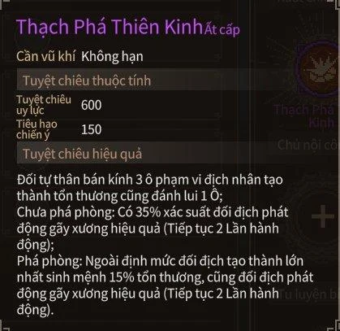
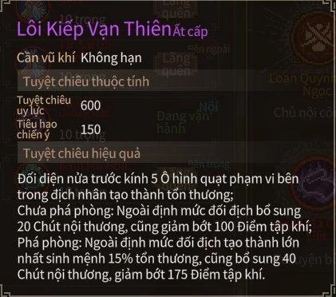
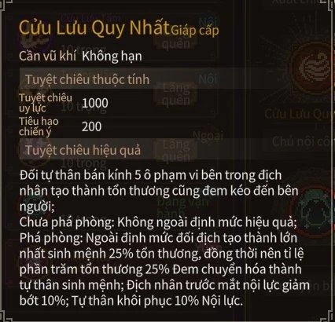
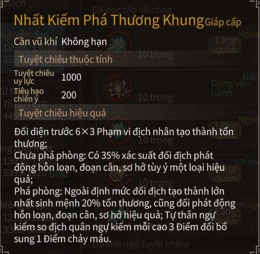
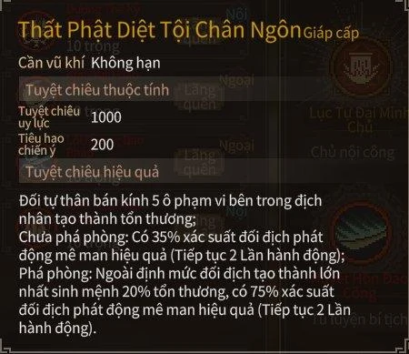
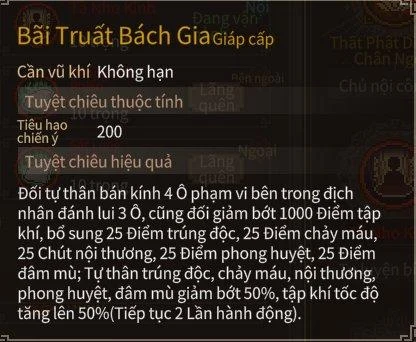
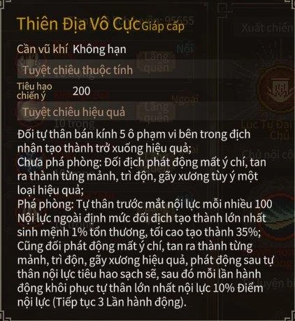
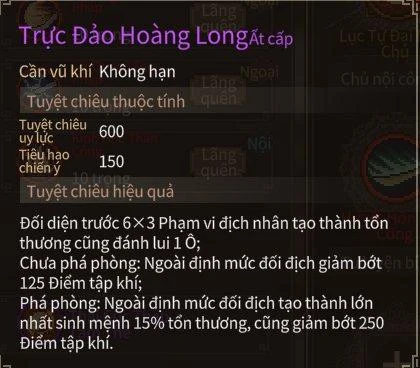
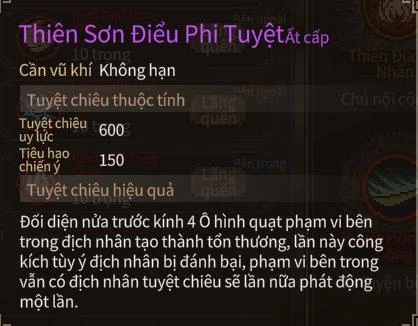
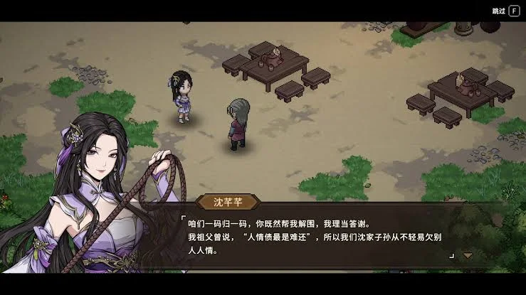

Hội anh em mê võ hiệp ơi, sau bài tổng hợp chiến lược thì nay Cenix làm tiếp hai món ai chơi _Hero's Adventure_ (Đại Hiệp Lập Chí Truyện) cũng phải săn: **tuyệt kỹ** và **thú cưỡi**. Một bên là chiêu cuối lật kèo trận đấu, một bên là con thú vừa chở anh em chạy khắp bản đồ vừa nhảy vào đánh phụ. Bài này soạn lại từ bảng hướng dẫn của cộng đồng người chơi Việt, kèm luôn ảnh thẻ chiêu trong game để anh em xem hiệu ứng.

<strong>Chuyện kết duyên</strong> với 25 nhân vật nữ khá dài nên Cenix tách thành một bài riêng: <strong>Hero's Adventure - Các cách kết duyên</strong>, anh em tìm trong mục Hướng dẫn nhé.

## Tuyệt kỹ — chiêu cuối đốt chiến ý

Hiện có **21 tuyệt kỹ** nhân vật chính học được. Muốn tung tuyệt kỹ phải đủ **chiến ý**, dùng xong là trừ. Chiến ý tích được từ trang bị, thiên phú, và ngay trong trận mỗi lần đánh hoặc bị đánh.

-   **Phẩm cấp**: Giáp (cam) mạnh nhất, thường có uy lực **1000** và tốn **200 chiến ý**. Ất (tím) uy lực 600, tốn 150. Bính (lam) rẻ nhất, tốn 100.
    
-   **Phá phòng**: hầu hết tuyệt kỹ có hai nấc hiệu ứng. Chưa phá phòng của địch thì chỉ ăn hiệu ứng phụ, phá được phòng thì cộng thêm sát thương theo **% máu tối đa** của địch (15 đến 25%) và hiệu ứng mạnh hơn.
    
-   **Không kén vũ khí**: toàn bộ 21 chiêu đều ghi "cần vũ khí: không hạn", cầm gì cũng tung được.
    

<strong>Mẹo:</strong> phần lớn tuyệt kỹ gắn với môn phái hoặc trận doanh. Một vòng chơi chỉ vào được một môn, nên chọn môn phái cũng là chọn bộ tuyệt kỹ. Hai chiêu ai cũng học được là <strong>Thạch Phá Thiên Kinh</strong> và <strong>Lôi Kiếp Vạn Thiên</strong>.

### Hai chiêu ai cũng học được

**Thạch Phá Thiên Kinh** (Ất): đọc tấm bia sâu trong rừng Mê Tung khi **ngộ tính đúng bằng 1**. Đánh quanh mình 3 ô, đẩy lùi địch, chưa phá phòng có **35%** gây gãy xương.

_Ngộ tính 1 mà học được chiêu xịn, đúng là ngu mà có phúc._

**Lôi Kiếp Vạn Thiên** (Ất): giải đủ câu đố tầm bảo ở 3 thành để mở Bãi Tha Ma, đào hết mộ và **bị sét đánh 10 lần** trong đó. Quạt hình nón bán kính 5, thêm nội thương và trừ tụ khí của địch.

### Lão đầu môn và Cửu Lưu Môn

-   **Cửu Lưu Quy Nhất** (Giáp): bái sư ông lão đầu làng, theo cốt truyện tới khi diệt xong Cửu Lưu Môn, **Yến Ca Hành** đưa cuộn giấy. Kéo hết địch trong bán kính 5 về sát mình. Phá phòng thì cộng **25% máu tối đa** của địch, hút 25% sát thương thành máu, trừ 10% nội lực địch và hồi 10% nội lực cho mình.
    
-   **Vạn Kiếm Quy Tông** (Giáp): cách 1 là đi tuyến lão đầu môn tới khi diệt Cửu Lưu Môn, Sở Cuồng Sinh nhờ tìm một NPC có cả 5 tư chất từ 8 trở lên. Cách 2 là vào Cửu Lưu Môn, cứu Sở Cuồng Sinh ở Băng Lao rồi ra thủ thành chống Yên quân. Đánh bán kính 4, phá phòng cộng 20% máu tối đa, ngự kiếm hơn địch mỗi 3 điểm thì thêm 1 điểm chảy máu.
    
-   Yến Ca Hành còn dạy thêm hai tuyệt kỹ nữa: một chiêu cho người theo **Cửu Lưu Môn đi nhánh phản ở Sở Tương thành** (gặp ở Miếu Hoang), một chiêu cho người **bái sư đầu làng** sau nhiệm vụ đi Nho Thánh Quán dò tung tích. Hai thẻ chiêu Giáp cấp còn lại trong bảng là **Loan Quỳnh Toái Ngọc** (phá phòng bỏ qua giáp, nội lực hơn địch mỗi 75 điểm cộng 1% máu tối đa, tối đa 35%) và **Đảo Chuyển Càn Khôn** (kéo địch trong bán kính 7, 10% sát thương thành máu).
    

_Cửu Lưu Quy Nhất: kéo cả đám về rồi hút máu, đúng chất trùm cuối._

### Lang Gia Kiếm Các

**Nhất Kiếm Phá Thương Khung** (Giáp): vào Lang Gia Kiếm Các, làm hết sự kiện, rèn được **Hiên Viên kiếm** thì Kiếm Si truyền lại. Chém khối 6×3 ô phía trước, chưa phá phòng có 35% gây hỗn loạn, đoạn cân hoặc sơ hở. Phá phòng cộng 20% máu tối đa, thêm chảy máu theo chênh lệch ngự kiếm.

### Tam giáo: Phật, Nho, Đạo

Cả ba nhà đều có chung một kiểu nhiệm vụ: vào môn, tăng hảo cảm, làm nhiệm vụ **trấn ma tam giáo**. Tới **ngày thứ 4**, khi Sở Cuồng Sinh phá xích Băng Lao thì **đứng im quan sát**, rồi về báo cáo với môn phái. Đánh thắng Sở Cuồng Sinh là nhận tuyệt kỹ của nhà mình.

**Thích Pháp Tự**

-   **Lục Tự Đại Minh Chú** (Giáp): bán kính 5, giảm phòng ngự địch 8% (phá phòng là 15% trong 3 lượt, cộng 20% máu tối đa).
    
-   **Thất Phật Diệt Tội Chân Ngôn** (Giáp): đọc xong Phạn Kinh Giải Dịch rồi đọc hết ba cuốn kinh cam **Đại Nhật, Bát Nhã, Duy Ma**. Chưa phá phòng có 35% gây mê man 2 lượt, phá phòng lên **75%**.
    
-   **Bồ Đề Kim Thân** (Ất): tăng hảo cảm với Thả Ách, ra khu rừng bên trái đánh với ông ấy, rồi khi quan hệ với chùa trên 60 vào chính điện đánh lần nữa. Thắng là Tuệ Nguyên dạy. Đồng đội trong bán kính 3 được **miễn sát thương 1 lần**.
    

**Nho Thánh Quán**

-   **Bãi Truất Bách Gia** (Giáp): làm khảo nghiệm 4 bia đá rùa bên trái (cần giám định tranh chữ và thư tịch từ cấp 4), rồi bấm vào bia giữa để đánh. Đẩy lùi địch 3 ô, trừ **1000 tụ khí**, rải đủ 5 loại trạng thái xấu, đồng thời giảm một nửa trạng thái xấu trên người mình và tăng 50% tốc độ tụ khí.
    
-   Chiêu thứ hai đến từ trận đánh Sở Cuồng Sinh như đã nói ở trên.
    

**Đạo Huyền Tông**

-   **Thiên Địa Vô Cực** (Giáp): để nhân đức xuống **-10** cho bị nhốt vào Vô Cực Động, xem bức tường đá với **ngộ tính từ 15** trở lên. Rải mất ý chí, tan giáp, trì độn, gãy xương. Phá phòng: nội lực hơn địch mỗi 100 điểm cộng 1% máu tối đa (tối đa 35%), đổi lại nội lực mình về 0 rồi hồi 10% mỗi lượt trong 3 lượt.
    
-   **Thái Cực Thập Tam Thế** (Ất): xong hết nhiệm vụ phá kiếm trận, quan hệ giáo phái đạt tôn kính sẽ có sự kiện Độc bà bà giả làm khách thắp hương. Giúp đốt hương ở chính điện, đánh thắng rồi nói chuyện với Trọng Dương Tử.
    
-   **Thiên Địa Bất Nhân** (Giáp): phá phòng có tỷ lệ **giết ngay** kẻ địch thường (không phải thủ lĩnh) cấp thấp hơn mình, chênh cấp càng nhiều càng dễ.
    

### Trận doanh: Diệp Gia Quân và Yên quân

-   **Trực Đảo Hoàng Long** (Ất): xong sự kiện của Diệp Ngân Bình ở 3 thành, tới Diệp Gia Quân mời cô ấy vào đội, giúp cô ấy đấu với Diệp nguyên soái. Thắng và có **ngộ tính từ 10** là học được. Chém 6×3 ô, trừ 125 tụ khí (phá phòng là 250).
    
-   **Sưu Sơn Kiểm Hải** (Ất): theo Yên quân, làm xong nhiệm vụ ám sát Lữ Văn Hoán rồi về báo cáo nguyên soái. Kéo một người trong 6 ô hình chữ thập về trước mặt: kéo địch thì gây sát thương, kéo đồng đội thì cho họ giảm 15% sát thương cuối.
    

### Các môn phái còn lại

-   **Trọc Lãng Bài Không** (Ất, Cửu Giang Thủy Trại): làm xong nhiệm vụ tiễn sứ giả rồi về báo cáo. Đẩy lùi địch, thêm 20 nội thương. Phá phòng thì 40 nội thương và mình tăng **15% bạo kích** trong 2 lượt.
    
-   **Thiên La Địa Võng** (Bính, Thần Bộ Môn): diệt 1 trong 3 trại rồi báo cáo Lạc Thiên Hùng. Gọi **3 bộ khoái** ra đánh phụ.
    
-   **Nhất Đao Tuyệt Trần** (Bính, Thanh Phong Trại): làm nhiệm vụ bắt cóc Đinh tiểu thư đòi tiền chuộc. Quạt nón bán kính 5, thêm chảy máu.
    
-   **Thiên Sơn Điểu Phi Tuyệt** (Ất, Yến Tử Ổ): xong nhiệm vụ trộm viên ngọc trai rồi báo cáo Bộ Tuyệt Trần. Hạ gục được một tên là chiêu tự **kích hoạt thêm lần nữa**.
    

_Giang hồ có vay có trả, chiêu cuối cũng vậy: muốn xài thì phải tích đủ chiến ý trước._

## Thú cưỡi — vừa làm xe, vừa làm vệ sĩ

Mỗi con thú có **tốc độ chạy bản đồ** riêng (xếp từ F chậm nhất tới S+ nhanh nhất), yêu cầu **cấp tuần thú** riêng, và có thiên phú khi ra trận. Bảng dưới gom hết 16 con trong bảng hướng dẫn.

| Thú | Nơi gặp | Tuần thú | Tốc độ | Điểm đáng chú ý |
|---|---|---|---|---|
| Gà trống Ti Thần | Làng Vô Danh | 0 | A | Mỗi ngày bắt 1 con trùng, mổ gây mù |
| Heo rừng Cương Liệt | Rừng Mê Tung | 1 | B- | Đỡ hoặc né là phản đòn |
| Chó lang thang | Sở Tương thành | 2 | E | Đỡ 50% sát thương cho chủ, mỗi ngày nhặt 1 món chưa giám định |
| Mèo | Tửu lâu Sở Tương | 1 | F | Mỗi ngày tha về 1 món thủy sản |
| Linh Viên | Thích Pháp Tự | 4 | C | +15% né, mỗi ngày hái 1 loại trái |
| Sói Khiếu Nguyệt | Dã Lang Cốc | 3 | S | Gọi 3 con sói khi đánh |
| "Mèo yêu" của Lục Kiếm Nam | Đại Lương thành | 5 | S | +5% bạo kích, đỡ, né. Cần cấp nhân vật trên 40 |
| Sương Răng | Bạch Linh Sơn | 5 | A+ | 15 chảy máu, bỏ qua giáp |
| Đan Thần | Mai Quan Dịch | không yêu cầu | B+ | 20% mê hoặc, +10% bạo kích và liên kích cho cả đội |
| Độc Long | Hang trong Cửu Lê Bộ Lạc | 4 | B | 15 trúng độc. Cần độc thuật 60 |
| Vượn đen | Khu khai khoáng Lang Gia Kiếm Các | 4 | B+ | Trừ 75 đến 100 tụ khí địch. Cần danh vọng 4 |
| Bạch Thủ | Trường Sinh Trủng | 4 | B+ | Đánh bỏ qua giáp |
| Đạp Phong | Vạn Trúc Khê (Đông Nam) | 5 | **S+** | +30% tốc độ chạy bản đồ, +15% tụ khí cho đội |
| Gấu | Đoạn Hồn Lâm | 3 | D | Đỡ **70%** sát thương cho chủ |
| Huyền Sương | Trúc Lâm (Tây Nam) | 5 | C | +10% đỡ đòn, giảm 15% sát thương |
| Hỏa Thiềm Thừ | Hỏa Thiềm Động (Tây Vực) | 5 | S- | Đứng gần là chủ miễn trúng độc. Cần độc thuật 80 |

### Cách bắt mấy con khó nhằn

-   **Gà trống Ti Thần**: thắng 5 trận đá gà với tên ăn mày trước cửa Đinh gia (Sở Tương) để nó nhận thiên phú **Gà Trống Chi Uy** (+15% bạo kích, +50% sát thương lên động vật). Dắt qua Vạn Thú Sơn Trang đá với con gà bên đó còn được giang hồ lịch luyện.
    
-   **Mèo**: nhận việc xử lý con mèo ăn vụng sau tửu lâu Sở Tương, cho nó ăn **5 con cá chép vàng** (câu ở Đoạn Hồn Lâm hoặc hậu sơn gia viên).
    
-   **Linh Viên**: gặp ở 3 chỗ trong chùa. Ngoài sân thì đánh với nó (dễ nhất nếu không phải người của chùa), trong bếp cho ăn 5 cái bánh bao, ở Tàng Kinh Các giảng kinh cho nó nghe. Tương tác đủ 5 lần là nhận nuôi được.
    
-   **Sói Khiếu Nguyệt**: dẫn Lưu Thập Bát theo thì nó không tấn công. Nuôi rồi thì vào hang dưới chỗ cây Hoa Lê Thương không bị sói đánh nữa.
    
-   **"Mèo yêu"**: danh vọng từ 4, nói chuyện với Lục Kiếm Nam trước khách sạn Sở Tương, rồi lên Đại Lương thành, đi Châu Quang Bảo Khí Lâu, vào phủ Tề Vương, rẽ phải ra hậu viện. Nuôi xong nó ở sâu trong hậu sơn gia viên.
    
-   **Đan Thần**: mua một phần **bánh ngọt** ở người bán đồ ngọt gần đó cho nó ăn là mở nhận nuôi.
    
-   **Độc Long**: khi Miêu Thải Điệp đủ 100 hảo cảm sẽ nhờ tìm trứng Độc Long. Cho Độc Long ăn côn trùng tới 60 thân mật rồi di chuyển nhân vật, nó **biến dị** và đẻ trứng. Ăn trứng được thiên phú **miễn nhiễm trúng độc**. Độc Long thường và biến dị tính là hai con khác nhau, nên nhận nuôi cả hai để đủ đồ giám.
    
-   **Đạp Phong**: tới tiêu cục Hoàng Mộc Cảng nghe tin chuyến tiêu bị cướp, đi lên hướng Tây Bắc, dưới thác nước là Vạn Trúc Khê. Đây là thú cưỡi nhanh nhất game, một khi đã máu thì đừng hỏi bố cháu là ai nữa, phải bắt cho bằng được.
    
-   **Gấu**: đạt cấp 35 sẽ có bà lão trước tượng anh hùng Sở Tương hỏi chuyện để mở Đoạn Hồn Lâm. Đánh thắng con gấu 3 lần nó sẽ biến mất, ra khỏi rừng rồi quay lại sẽ thấy nó đi lang thang gần đó.
    
-   **Huyền Sương**: gặp khi đi tìm măng chữa bệnh cho trang chủ Vạn Thú Sơn Trang. Đánh hết rồi cho ăn và nhận nuôi.
    
-   **Hỏa Thiềm Thừ**: bắt về chữa thương cho Tử Thiên, hoặc giết đi để chặn việc chữa thương nếu anh em theo Thánh Hỏa Tông.
    

<strong>Trứng phục sinh:</strong> dắt Vượn đen tới Trường Sinh Trủng khi chưa nhận nuôi Bạch Thủ, hai con tinh tinh sẽ diễn luôn màn King Kong đại chiến. Chó lang thang và sói Khiếu Nguyệt còn dùng để đánh hơi trong sự kiện tìm thầy thuốc ở Vạn Thú Sơn Trang.

Hôm nay không chơi hôm nào chơi? Anh em đang dắt con gì đi giang hồ, và tuyệt kỹ ruột của mấy ông là chiêu nào? Kể Cenix nghe dưới phần bình luận, nhất là ông nào đã bắt đủ 16 con thú rồi thì xin quỳ.

*Nguồn tham khảo: Bảng "Hero Adventure // Hướng dẫn cơ bản Đại Hiệp Lập Chí" của cộng đồng người chơi Việt, Cenix biên soạn lại*
