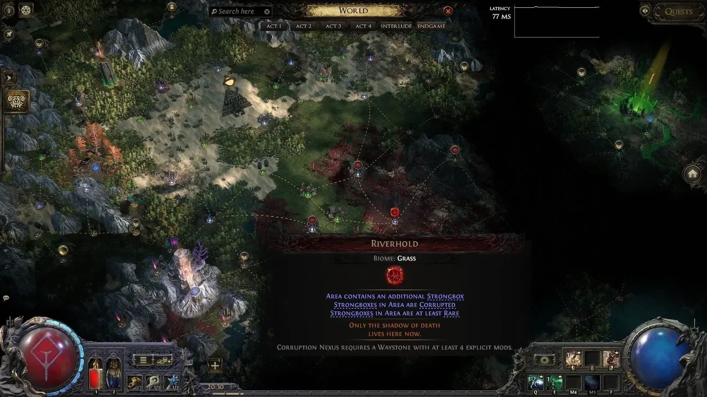

Đi Atlas trong _Path of Exile 2_ một hồi là anh em gặp ba nhân vật: **Jado**, **Doryani** và **Hilda**. Ba ông này gọi là **Atlas Master**, mỗi ông mở ra một cây passive riêng với một kiểu thưởng riêng. Chà, quyết định khó quá, làm sao để tốt cho cả ba? Thì không cần tốt cho cả ba — chọn ông hợp với kiểu cày của mình là được.

<strong>Nguyên tắc quan trọng:</strong> Cây Atlas ở PoE 2 <strong>không respec được</strong>. Đọc kỹ ba ông thầy này rồi hẵng bấm, đừng bấm theo cảm hứng rồi ngồi tiếc cả mùa.

## Jado — ông thầy của dân săn đồ Unique

Nhánh của Jado gọi là **Spycraft**. Hướng của ông này rất rõ: tăng chất lượng **Strongbox**, tăng đồ rơi từ boss, và tăng tỉ lệ ra đồ **Exceptional**. Anh em nào mở map lên là lao đi tìm rương, hoặc đang săn một món Unique cụ thể, thì đây đúng là thầy của mình.

### Mở khoá

Hoàn thành **Sealed Vault** ở **Ziggurat Refuge**, sau đó đi gom **artifact** để mở hàng passive đầu tiên.

### Nên bấm gì ở từng hàng

-   **Hàng 1** — In The Wrong Hands
-   **Hàng 2** — Eastern Knowledge
-   **Hàng 3** — Partial Translations
-   **Hàng 4** — Untold Histories, hoặc Ancient Activations

## Doryani — ông thầy của dân cày map dày

_Mỗi Master có 4 hàng passive, mỗi hàng vài lựa chọn — bảng dưới đây để anh em hình dung quy mô._

Nhánh **Science**. Doryani đi theo hướng tăng mật độ quái và scale mod của map: waystone càng cắm nhiều mod thì càng ăn nhiều từ ông này, kèm theo phần thưởng boss dày hơn. Đây là ông thầy hợp với anh em thích juice map lên rồi cày một mạch.

### Mở khoá

Clear một **nexus vùng nhiễm (corrupted Nexus)** là mở được tuyến của ông.

### Nên bấm gì ở từng hàng

-   **Hàng 1** — Stitch the Flesh
-   **Hàng 2** — Improved Calibration
-   **Hàng 3** — Volatile Connection
-   **Hàng 4** — Remnants of Greatness

## Hilda — ông thầy của dân thích ăn hành

Nhánh **Hunting**. Hilda buff thẳng vào sức mạnh của quái **Rare** và **Unique**, đổi lại đồ rơi từ boss ngon hơn hẳn. Nói cho rõ ràng: **map sẽ khó lên đáng kể**, không phải khó tí ti.

### Mở khoá

Hilda đứng ở một khu trại trước **Withered Willow**. Bà đánh dấu một con thú — anh em đi săn và hạ nó, xong quay lại nói chuyện là mở.

### Nên bấm gì ở từng hàng

-   **Hàng 1** — Mighty Prey
-   **Hàng 2** — Will of the Draiocht
-   **Hàng 3** — Call of the Spirits
-   **Hàng 4** — Patient Battue

<strong>Cenix mách nhỏ:</strong> Đừng đụng vào Hilda khi build còn mỏng. Nhánh của bà buff quái trước, trả thưởng sau — đồ chưa tới mà bấm sớm thì anh em chết ở map của chính mình. Xây người xong hẵng tính.

## Chọn ông nào trước?

Không có đáp án đúng cho tất cả, nhưng có thể chốt theo kiểu chơi:

-   Muốn **đồ Unique cụ thể** hoặc thích mở rương → đi **Jado**.

-   Muốn **cày nhanh, map dày, ra nhiều đồ chung** → đi **Doryani**.

-   Muốn **đánh khó ăn đậm** và build đã cứng → đi **Hilda**.

Ba nhánh này không loại trừ nhau, chỉ là điểm có hạn nên phải chọn thứ tự. Cày lâu thì trước sau gì cũng chạm được cả ba.

## Tóm gọn cho ông nào lười đọc

| Master | Nhánh | Cho gì | Mở khoá |
|---|---|---|---|
| **Jado** | Spycraft | Strongbox, đồ boss, tỉ lệ Exceptional | Sealed Vault ở Ziggurat Refuge + gom artifact |
| **Doryani** | Science | Mật độ map, scale mod waystone, thưởng boss | Clear một corrupted Nexus |
| **Hilda** | Hunting | Quái Rare/Unique mạnh hơn, đồ boss ngon hơn | Săn con thú bà đánh dấu ở trại trước Withered Willow |

Anh em đang theo ông thầy nào — Jado săn Unique, Doryani cày dày, hay lỡ máu bấm Hilda rồi giờ map nào cũng toát mồ hôi? Kể Cenix nghe với.

*Nguồn tham khảo: [games.gg — Larc](https://games.gg/path-of-exile-2/guides/path-of-exile-2-all-atlas-masters-passives/)*
