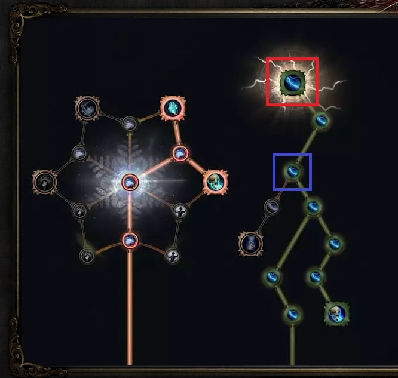
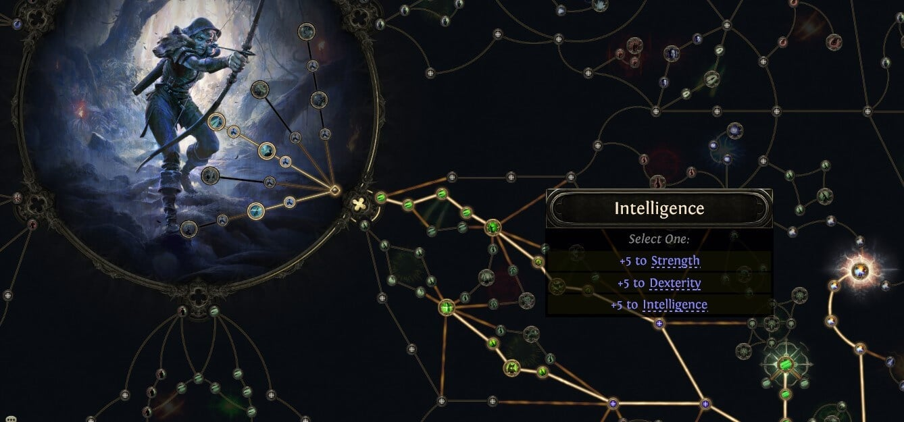

Mở cây kỹ năng bị động của _Path of Exile 2_ lần đầu, cảm giác chung của anh em là gì? Là hoa mắt. **Hơn 1.000 điểm passive** rải kín màn hình, chằng chịt như bản đồ tàu điện ngầm Tokyo. Ngồi xuống uống miếng nước rồi nghe nè — cái cây đó không khó như vẻ ngoài của nó đâu, chỉ là anh em đang nhìn sai chỗ thôi.

<strong>Nguyên tắc quan trọng:</strong> Đừng đọc từng ô nhỏ một. Cách đọc đúng là nhìn các <strong>Notable</strong> và <strong>Keystone</strong> trước, chốt xem mình muốn tới đâu, rồi mới tính đường đi. Ô nhỏ chỉ là gạch lát đường.

## Bốn loại điểm, phân biệt được là xong một nửa

_Một cụm điển hình: mấy ô nhỏ cùng chủ đề vây quanh một Notable ở giữa._

### 1. Small Passive — ô vuông xanh

Loại nhiều nhất, cho bonus lẻ tẻ: **+10% Spell Damage**, cộng chút chỉ số, chút tốc độ đánh. Một ô thì chẳng bõ, nhưng đi qua vài chục ô trên đường tới đích thì cộng dồn cũng đáng kể.

### 2. Notable — ô vuông đỏ

Đây mới là thứ đáng để anh em nhắm tới. Notable là điểm mốc lớn, ăn đứt ô nhỏ, và thường "ăn theo" chủ đề của cụm ô nhỏ quanh nó. Ví dụ một Notable cho luôn: **20% Spell Damage, 5% Cast Speed, +20 Intelligence**.

### 3. Travel / Attribute — ô nối đường

Cho **+5 vào một chỉ số bất kỳ do anh em chọn**, và nhiệm vụ chính là làm cầu nối sang khu khác của cây. Điểm hay: **chỉ số của mấy ô này đổi được bất cứ lúc nào**, không phải respec.

_Mấy ô nối đường trông nhạt vậy thôi, nhưng không có nó thì đừng mơ đi sang vùng khác._

### 4. Keystone — thứ định hình cả build

Keystone cho sức mạnh cực lớn nhưng **luôn kèm một cái giá**. Ba ví dụ trong game:

-   **Chaos Inoculation** — Máu tối đa còn đúng **1**, đổi lại miễn nhiễm hoàn toàn sát thương Chaos.

_Chaos Inoculation: còn 1 máu, nghe rợn nhưng cả một trường phái build sống nhờ nó._

-   **Giant's Blood** — Cầm vũ khí cận chiến hai tay bằng một tay, đổi lại **yêu cầu chỉ số của vũ khí nhân đôi**.

-   **Necromantic Talisman** — Toàn bộ bonus từ Amulet chuyển hết sang cho Minion thay vì cho anh em.

<strong>Cenix mách nhỏ:</strong> Một khi đã máu thì đừng hỏi bố cháu là ai nữa — nhưng Keystone thì đừng máu. Anh em <strong>không bắt buộc phải lấy Keystone nào cả</strong>, và phần lớn build cũng chỉ lấy một hai cái là cùng. Lấy một Keystone mà không có cách gánh mặt trái của nó thì thà đừng lấy.

## Ba chỉ số, ba lối chơi

Cây được chia theo ba chỉ số, và mỗi chỉ số là một kiểu đánh:

-   **Strength (đỏ)** — đánh cận chiến, đấm phát nào ra phát đó.

-   **Dexterity (xanh lá)** — đánh xa, tốc độ cao.

-   **Intelligence (xanh dương)** — phép thuật và triệu hồi.

Các class lai nằm ở vị trí trung gian giữa hai vùng, ăn được cả hai bên.

Vị trí xuất phát của vài class quen mặt: **Witch** ở chính giữa phía trên (thuần Intelligence), **Ranger** ở giữa lệch phải rồi toả lên góc trên phải và xuống góc dưới phải, **Warrior** ở giữa lệch trái rồi toả sang hai góc bên trái.

## Không có hàng rào nào cả

Đây là chỗ nhiều anh em hiểu nhầm nhất. Game **không hề cấm** anh em đi sang vùng khác:

> Chơi Witch không có nghĩa là không được cắm điểm vào vùng Strength, nếu ở đó có thứ anh em cần.

Cây là của chung, ai đi tới đâu cũng được — chỉ là đi xa thì tốn nhiều điểm nối đường hơn thôi.

## Điểm ở đâu ra, và respec tốn gì

Anh em nhận **1 điểm passive mỗi lần lên cấp**, cộng thêm một số điểm từ vài nhiệm vụ nhất định trong chiến dịch.

Muốn đổi điểm đã cắm thì tìm **The Hooded One**, trả bằng **Gold**. Và đây là chỗ phải nói thẳng:

> Respec ở PoE 2 không rẻ như mấy game ARPG khác.

Nên cắm điểm cứ từ tốn, tính trước vài bước còn hơn cắm bừa rồi gom vàng đi chuộc lỗi.

## Quy trình 4 bước để tự vạch đường

1.  Xác định **Keystone** nào gần mình và hợp với build đang chơi.

2.  Tính đường đi tới các **Notable** mình muốn — chọn tuyến nào đi qua nhiều ô nhỏ có ích nhất.

3.  Vạch tiếp lộ trình cho những cấp sau, đừng chỉ tính tới cấp hiện tại.

4.  Nghĩ trước cách gánh mặt trái của Keystone mình định lấy.

<strong>Mẹo tiết kiệm nửa tiếng dò cây:</strong> Bấm <strong>Ctrl-F</strong> ngay trong giao diện cây rồi gõ từ khoá. Chơi Lightning Sorceress thì gõ "lightning", cây sẽ tự sáng hết những điểm liên quan. Khỏi soi từng ô.

## Tóm gọn cho ông nào lười đọc

-   Nhìn **Notable** và **Keystone** trước, ô nhỏ tính sau.

-   Keystone mạnh nhưng luôn có giá phải trả — không lấy cũng chẳng sao.

-   Ô nối đường cho **+5 chỉ số tuỳ chọn**, đổi thoải mái không cần respec.

-   Class nào cũng đi được sang vùng của class khác.

-   **1 điểm mỗi cấp** + vài điểm từ nhiệm vụ; respec trả bằng Gold ở The Hooded One và **không rẻ**.

-   **Ctrl-F** là người bạn thân nhất khi dò cây.

Rồi đó, giờ mở cây lên nhìn lại thử xem có đỡ hoa mắt chưa? Anh em đang chơi class nào và định nhắm Keystone nào — kể Cenix nghe với, biết đâu có ông đang tính lấy Chaos Inoculation mà chưa biết mình sắp còn đúng 1 máu.

*Nguồn tham khảo: [Mobalytics](https://mobalytics.gg/poe-2/guides/passive-skill-tree)*
