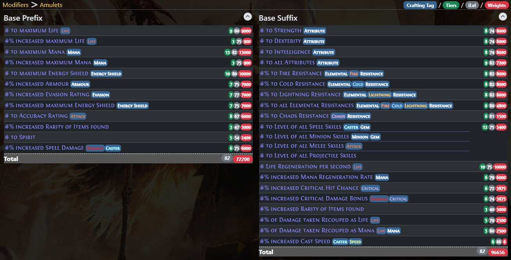

Chơi **SSF (Solo Self-Found)** trong _Path of Exile 2_ nghĩa là không mua được đồ của ai hết. Muốn mặc gì thì tự cày base, tự gom currency, tự craft. Nghe khổ, nhưng craft ở PoE 2 có trình tự đàng hoàng chứ không phải đập bừa cầu may. Để Cenix kể cho nghe.

<strong>Ba thứ phải nắm trước khi đập viên currency đầu tiên:</strong> (1) <strong>Item Modifier</strong> — mình đang muốn ra mod gì, tra ở poe2db; (2) <strong>Item Level</strong> — mod mình muốn cần iLvl tối thiểu bao nhiêu; (3) <strong>Weight</strong> — trọng số quyết định xác suất mod đó xuất hiện. Thiếu một trong ba là craft mù.

_Bảng mod của amulet: mỗi mod đều có tier, iLvl yêu cầu và trọng số riêng. Đây là thứ anh em phải tra trước khi đập._

## Trình tự currency chuẩn

Craft một món từ trắng lên full mod đi theo đúng thứ tự này:

1.  **Transmute Orb** — đồ trắng thành xanh dương, có **1 mod**.

2.  **Augment Orb** — thêm **mod thứ 2** cho đồ xanh.

3.  **Essence** — thêm **mod thứ 3**, đồng thời nâng lên rare.

4.  **Exalt Orb** — thêm **mod thứ 4 và thứ 5**.

5.  **Desecrate** — thêm **mod cuối cùng**, cần cơ chế Abyss.

Ngoài ra còn **Alchemy Orb**: nhảy cóc cả dây chuyền trên, biến đồ trắng hoặc xanh thành rare với **4 mod ngẫu nhiên** luôn. Nhanh nhưng hên xui.

## Gom base — việc phải làm khi đang cày map

Đây là phần dân SSF hay làm ẩu nhất. Cách làm đúng:

-   Dùng **Filterblade** chỉnh filter, nhắm đúng base và ngưỡng **iLvl** mình cần.

-   Có **quad stash tab** riêng để chất base gom được trong lúc cày.

-   Tách riêng **phiên craft** — cày xong về ngồi đập một thể, đừng vừa cày vừa craft.

<strong>Ví dụ cho dễ hình dung:</strong> Muốn giày <strong>35% movement speed</strong> thì base phải <strong>iLvl 82 trở lên</strong>, nhặt giày iLvl thấp hơn là craft cỡ nào cũng không ra. Ngược lại, găng <strong>+2 Melee Skills</strong> và mũ <strong>+2 Minion Skills</strong> chỉ cần <strong>iLvl 41</strong> — gặp base nào là nhặt base đó, rẻ mà ăn.

## Đừng vứt đồ craft hỏng

Nguyên tắc sống còn của SSF: **không có gì là rác**. Alchemy ra mod xấu thì mang ra **bàn reforge** — gộp **3 món cùng độ hiếm** thành **1 món chưa định danh**. Nghĩa là mỗi lần craft hỏng vẫn góp phần cho một lần thử mới, thay vì mất trắng.

## Đồ chơi hạng nặng: Essence hoàn hảo và các loại Omen

### Perfect Essence

Xoá **một mod** và đảm bảo thay bằng mod xác định. Đây là thứ biến một món "ngon" thành một món "khủng". Trên món đã đủ **6 mod**, Perfect Essence tự xoá mod thuộc nhóm đối diện — coi như bảo vệ mấy mod anh em đã dày công làm ra.

### Omen của Abyss

-   Ép desecrate ra **Prefix** hoặc **Suffix** theo ý mình.
-   **Abyssal Echoes** — cho lộ lại mod.
-   **Omen of Light** — cho thử lại.

### Omen của Ritual — đám nặng đô nhất

-   **Greater Exaltation** — nhân đôi hiệu ứng Exalt, đẻ thêm Greater/Perfect Exalted Orb.
-   **Sinistral / Dextral Exaltation** — ép thêm đúng Prefix hoặc Suffix.
-   **Crystallisation Omen** — bắt Perfect Essence chỉ được xoá Prefix hoặc chỉ Suffix.
-   **Whittling** — Chaos Orb kế tiếp reroll đúng mod có iLvl thấp nhất.
-   **Fracturing Orb** — khoá cứng một mod, không đổi được nữa (món phải có tối thiểu **4 mod**).

### Ba combo đáng nhớ

-   **Perfect Essence + Crystallisation Omen** — biết chắc mod nào sẽ bị xoá, thay đúng thứ mình ghét mà không đụng thứ mình quý.

-   **Fracturing + Essence of the Abyss** — fracture thường chỉ **1 ăn 4**, thêm Essence of the Abyss là lên **1 ăn 3**. Ghép thêm Crystallisation để giữ mod desecrate trong lúc fracture.

-   **Omen of Putrefaction** trên giày — corrupt món đồ, biến cả **6 mod** thành bản Desecrated, rồi chọn lần lộ mod đẹp nhất.

## Một ví dụ craft từ đầu tới cuối

Làm một cây **vũ khí vật lý** phổ thông:

1.  Transmute rồi Augment tới khi trúng **% Physical Damage tier 2–1**.

2.  Đập **Greater Essence of Abrasion** — lên rare, kèm sát thương vật lý phẳng cỡ tier 3.

3.  Dùng **Omen of Greater Exaltation** + **Omen of Dextral Exaltation** + **Greater Exalted Orb**.

4.  **Desecrate**, cầu ra mod lai physical/accuracy.

5.  **Perfect Essence of Battle** — xoá một suffix ngẫu nhiên, thêm **+3 Attack Skills**.

Hai món đáng làm khác: **Amulet +3 Level of Skills** thì cứ đổ gold gamble cho tới khi ra amulet có mod đó, rồi mới Essence, Exalt, Desecrate thêm; **giày movement speed** thì dùng **Essence of Hysteria** — xoá một mod ngẫu nhiên, thêm **30% movement speed**, cực hợp với giày đã đủ 6 mod trong đó có 3 suffix ngon.

## Tóm gọn cho ông nào lười đọc

-   Trình tự: **Transmute → Augment → Essence → Exalt → Desecrate**. Alchemy là đường tắt hên xui.

-   Nắm **Modifier – iLvl – Weight** trước khi đập, không thì craft mù.

-   Chỉnh **Filterblade**, gom base vào quad tab, craft thành phiên riêng.

-   Craft hỏng thì **reforge 3 món thành 1**, đừng vứt.

-   **Perfect Essence + Omen** là chỗ biến đồ khá thành đồ khủng.

-   Nhớ ngưỡng iLvl: giày 35% move speed cần **iLvl 82+**, găng/mũ +2 skill chỉ cần **iLvl 41**.

Anh em chơi SSF mùa này craft được món nào ưng nhất rồi — khoe cái mod lên cho Cenix ngó với? Mà nói thật, có ông nào lỡ đập Fracturing Orb vào đúng cái mod dở nhất chưa, thú tội đi.

*Nguồn tham khảo: [Mobalytics](https://mobalytics.gg/poe-2/guides/ssf-crafting)*
