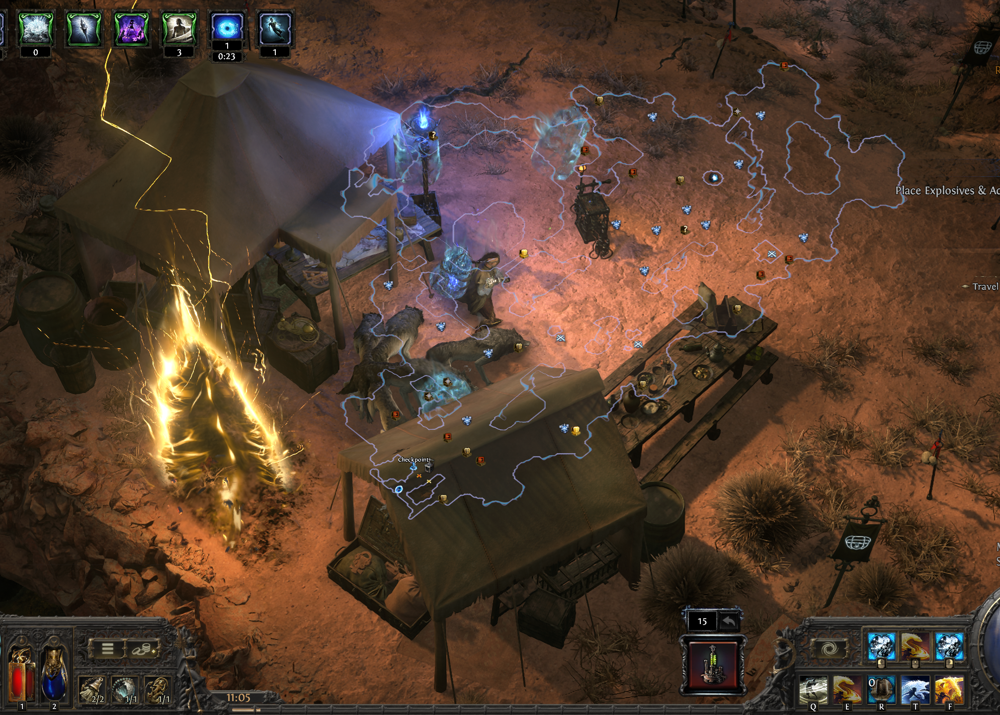
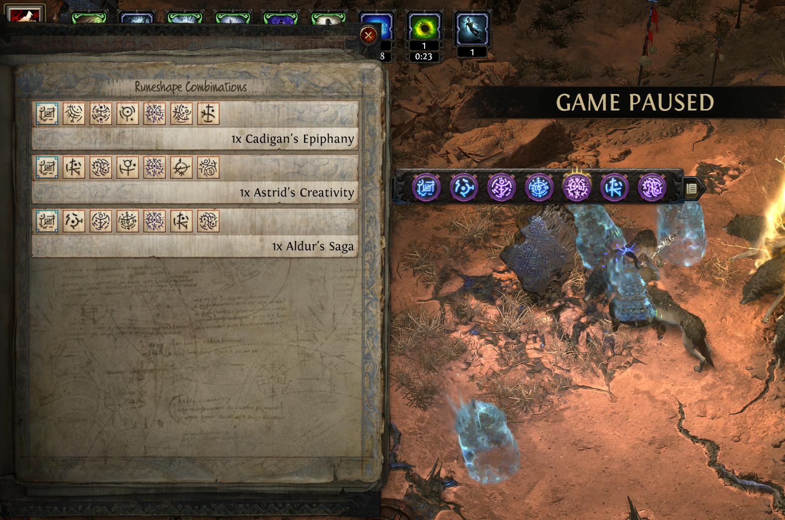
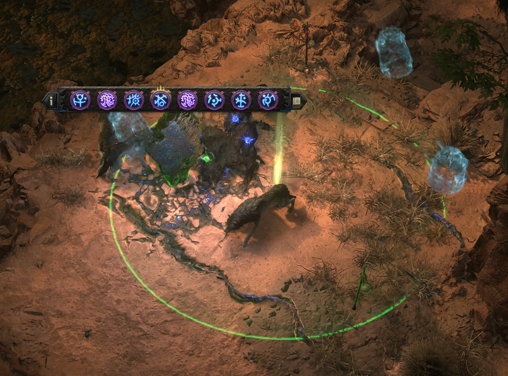
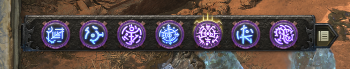
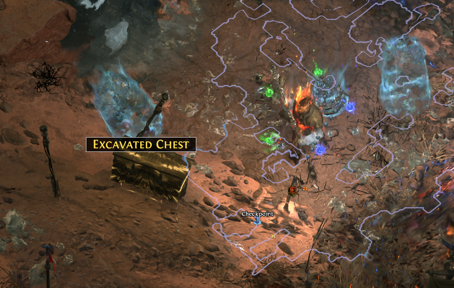
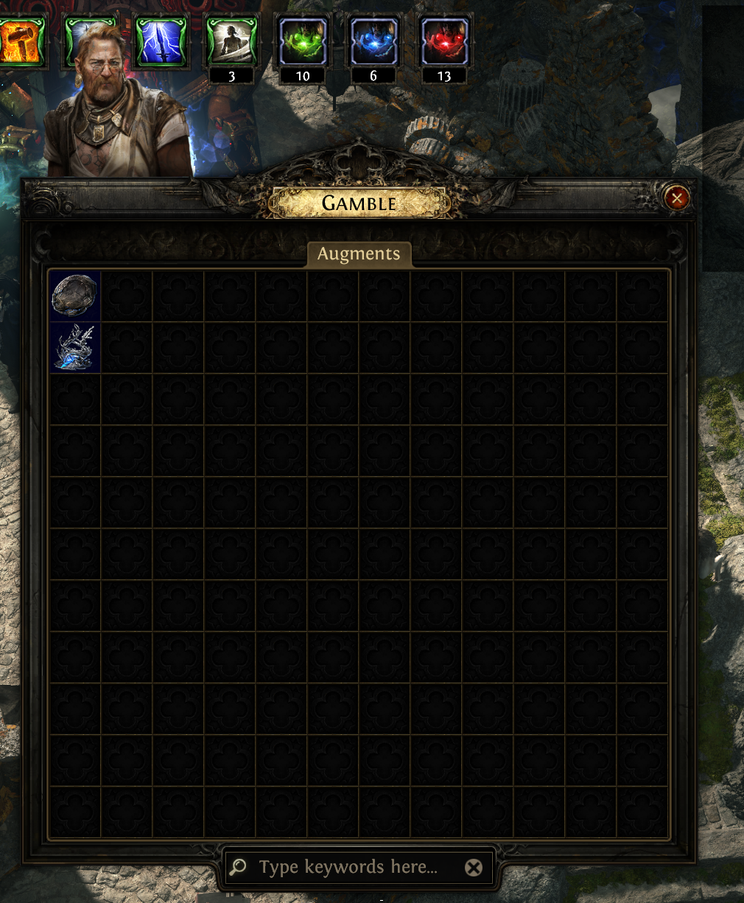
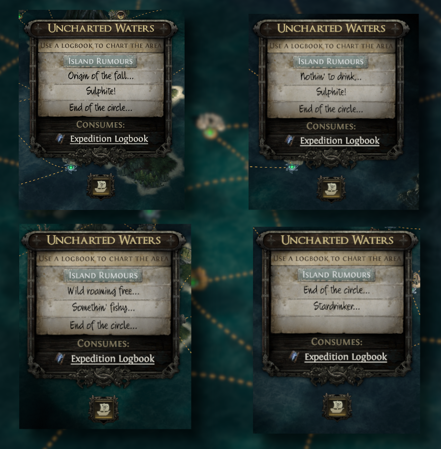
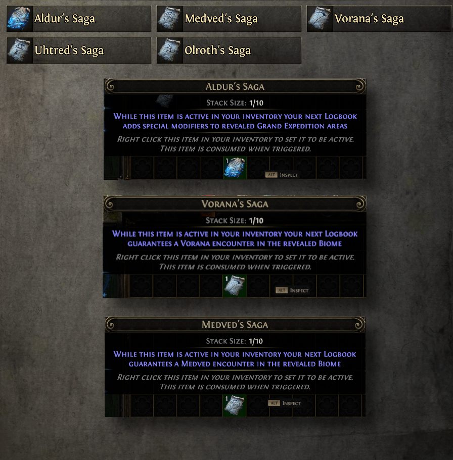

Mở khoá được **lặn biển** rồi mà chạy sai cách thì cũng chỉ nhặt được đồ lẻ tẻ, uổng công cả chuỗi quest Kingsmarch. Bài này là phần hai — cách chạy **Grand Expedition** cho ra đồ thật. Để Cenix kể cho nghe.

<strong>Nắm cái này trước mọi thứ khác:</strong> Thứ ra tiền trong Expedition là <strong>Runic Monster</strong> — đám quái đứng cạnh <strong>cột cờ lớn</strong>. Lý do: mod tăng tỉ lệ rơi Logbook và passive <strong>Detailed Records</strong> <strong>CHỈ áp dụng cho Runic Monster</strong>. Bỏ cột cờ để đi nhặt remnant vớ vẩn là lỗ.

## Sáu bước chạy một trận

1.  **Dò khu** — vào là cả minimap hiện ra: Runic Remnant, thưởng currency thường, thưởng currency hiếm, cơ chế đặc biệt, khu ngầm, bộ kích nổ, và **cờ đỏ** đánh dấu chỗ quái mọc.

2.  **Xem thưởng** — ngó trước các lựa chọn Remnant rồi mới quyết.

3.  **Vạch tuyến** — tính trước sẽ nối những quả thuốc nổ nào với nhau.

4.  **Đặt thuốc nổ** — nối **từ 15 quả trở lên** trải khắp khu.

5.  **Bật checkpoint** — đặt xong quả cuối thì di chuyển tới bộ kích nổ.

6.  **Kích nổ** — dây cháy chạy theo thứ tự, quái bung ra và các trận thưởng bắt đầu.

## Thứ tự ưu tiên Remnant — học thuộc là đủ giàu

Chọn theo đúng thứ tự này, đừng tham cái lấp lánh:

1.  **Runic Monster Duplication** — nhân đôi quái ra tiền
2.  **Logbook Quantity** — thêm logbook để còn lặn tiếp
3.  **Rare Monster spawns**
4.  **Item Quantity**
5.  **Item Rarity**

<strong>Remnant chữ vàng — coi chừng:</strong> Mấy mod Remnant màu vàng có thể làm trận đó <strong>không chạy nổi</strong>. Gặp cái nào quá gắt thì bỏ qua, đừng cố.

## Mẹo ăn tiền: chuyển Rune sang pack sau

Mỗi Rune cho đám quái mọc lên một hiệu ứng — có cái buff quái, có cái cho quái cơ hội hồi sinh ở độ hiếm cao hơn. Nhưng điểm quan trọng nhất là:

> Rune nào có **viền vàng** sẽ được **chuyển tiếp** sang các pack quái sau trong cùng chuỗi.

Nghĩa là nếu anh em xếp chuỗi khéo, mấy pack cuối sẽ gánh chồng chất buff — quái khoẻ kinh khủng nhưng đồ rơi ra cũng khủng theo. Đây là chỗ tách biệt người chạy cho có với người chạy để giàu.

## Bốn ông thợ và mớ Artifact

Chạy Expedition ra một loại tiền riêng gọi là **Artifact**, mỗi loại giao cho một ông thợ:

| Thợ | Nhận Artifact | Làm ra |
|---|---|---|
| **Rog** | Black Scythe | Giáp |
| **Gwennen** | Broken Circle | Vũ khí |
| **Tujen** | Order | Trang sức |
| **Dannig** | Sun | Đổi sang loại Artifact khác |

### Craft với thợ hoạt động thế nào

Chọn một **base** (item level scale lên tới **iLvl 80** khi nhân vật đạt **cấp 90**), rồi mỗi lượt game bày ra **3 lựa chọn nâng cấp**. Anh em có thể:

-   **Lấy** món đồ ngay
-   **Bỏ lượt** — nhưng lượt craft kế tiếp **đắt thêm 50%**, và **không được bỏ hai lượt liên tiếp**

Các lựa chọn nâng cấp gồm: reroll mod, chỉnh giá trị mod (kiểu Divine Orb), thêm mod (kiểu Exalted Orb), gỡ mod (kiểu Orb of Annulment).

Ngoài ra còn **Exotic Coinage** dùng để reroll danh sách hàng của thợ. Mấy loại Artifact này bán được qua **Currency Exchange**, nên kể cả không craft thì vẫn là tiền.

## Liquid Verisium — cứu vãn một Remnant xấu

Cắm passive Atlas **Feeling Lucky?** là mua được **Liquid Verisium** từ **Farrow**. Công dụng: **reroll một Runic Remnant đúng một lần**, dùng được cả trước lẫn sau khi đặt thuốc nổ. Gặp remnant xấu thì đây là phao.

## Cây Atlas cho Expedition

Thứ tự nên cắm:

1.  **Disturbed Rest** — tăng số cột cờ Runic Monster
2.  **Detailed Records** — logbook rơi nhiều hơn và có implicit đặc biệt
3.  **Timed Detonations** — nhiều Artifact hơn, nổ nhanh hơn
4.  **Legendary Battles** — nhiều quái Rare và Exotic Coinage hơn

Cắm thêm nếu dư điểm: **Frail Treasures** (hiện dấu rương, biến mất sau 5 giây), **Weight of History**, **Unearthed Anomalies**, **Extreme Archaeology**, **Feeling Lucky?**, **Expanding Territory**, **Calculated Investment**, **Double or Nothing**, **Cultivate the Sea**.

## Chọn "tin đồn" nào cho đáng

Mỗi Logbook cho anh em chọn giữa các **Rumour**, mỗi cái ra một kiểu map và một kiểu thưởng. Mấy cái đáng nhắm:

-   **Crazed Chieftain** (Jade Isles) — ra **Lineage Gem: Rakiata's Flow**
-   **A Good Fellow** (Moment of Zen) — một món **Unique** qua Nameless Seer
-   **Reflective Waters** (Lake of Kalandra) — nền **nhẫn**
-   **Something Fishy** (Bleached Shoals) — **amulet Pearlescent**
-   **Unknown Ruins** (Exhumed Ruins) — **lộ logbook miễn phí** qua Leyline
-   **Fallen Stars** (Moor of the Fallen Skies) — Runestone, chắc chắn có buff Runic Remnant
-   **Bleak and Awful** (Barren Atoll) — Strongbox

Bốn tin đồn boss thì rõ rồi: **Stardrinker** ra Uhtred, **Origin of the Fall** ra Olroth, **The Last to Fall** ra Vorana, **End of the Circle** ra Medved.

Còn **Logbook Omen**: mấy viên Omen boss (Vorana's, Medved's, Uhtred's, Olroth's) **đảm bảo** ra đúng Grand Expedition của con đó. Riêng **Aldur's Saga** thì buff cả trận lên mức mà Lolcohol gọi là "trên trời" — đảm bảo có Runic Remnant kèm thêm ô rune.

## Olroth — con trùm ra đồ nhất

**Olroth** mọc trong logbook có **Area Level 79 trở lên**, tỉ lệ khoảng **20%**, đánh dấu bằng **biểu tượng đầu lâu** trên minimap. Nên nếu anh em muốn gặp ông này thường xuyên thì phải đẩy logbook lên Area Level 79+ bằng cây Atlas.

Bài của ông ta:

-   **Sword Slam** — nâng kiếm, đập xuống tạo sóng xung kích lan ra
-   **Boomerang** — ném vũ khí, bay về kèm vùng sát thương Lạnh, **không có động tác báo trước**
-   **Carousel Degen** — dựng các cột xoay gây sát thương liên tục
-   **Charge Stab** — vũ khí phát sáng, lao tới rồi chém quét từ phải sang trái
-   **Pha 2** — sàn đấu hiện vật thể hình sao bắn tia Lạnh bám theo người, đạn Lạnh nổ, và tia lớn ở giữa tạo Chilled Ground

Cái đáng sợ nhất là **Boomerang không có tell** — nhớ giữ khoảng cách khi thấy ông ta ném.

## Bốn lỗi làm mất tiền oan

-   **Chết quá số lần** — Grand Expedition tính Revive giống Waystone, càng nhiều map modifier thì càng ít mạng.

-   **Tưởng map modifier tăng mọi thứ** — mod tăng độ khó chỉ cải thiện đồ **rơi từ quái**, **không** cải thiện đồ trong **rương, Strongbox và Remnant**.

-   **Nối thiếu thuốc nổ** — chỉ những remnant nằm trong chuỗi mới bung ra. Sót quả nào là mất luôn phần thưởng chỗ đó.

-   **Không tận dụng rune viền vàng** — bỏ phí cơ chế mạnh nhất của cả cơ chế Expedition.

## Tóm gọn cho ông nào lười đọc

-   Ưu tiên **Runic Monster** (cột cờ lớn) trên hết mọi thứ.

-   Remnant chọn theo thứ tự: **Duplication → Logbook Quantity → Rare Monster → Quantity → Rarity**.

-   Nối **15+ thuốc nổ**, tận dụng **rune viền vàng** để dồn buff sang pack sau.

-   Artifact giao đúng thợ: **Rog** giáp, **Gwennen** vũ khí, **Tujen** trang sức, **Dannig** đổi loại.

-   Cây Atlas: **Disturbed Rest → Detailed Records → Timed Detonations → Legendary Battles**.

-   Muốn gặp **Olroth** thì đẩy logbook lên **Area Level 79+**, tỉ lệ khoảng 20%.

Một khi đã máu thì đừng hỏi bố cháu là ai nữa — nhưng lặn biển thì nên tính toán, vì mỗi lần bấm là tốn một quyển Logbook. Anh em chạy Expedition hay chọn tin đồn nào nhất, mà đã ai gặp Olroth chưa? Kể Cenix nghe với.

*Nguồn tham khảo: [Maxroll](https://maxroll.gg/poe2/resources/expedition) · [Mobalytics — Lolcohol](https://mobalytics.gg/poe-2/guides/grand-expeditions-and-logbooks)*
