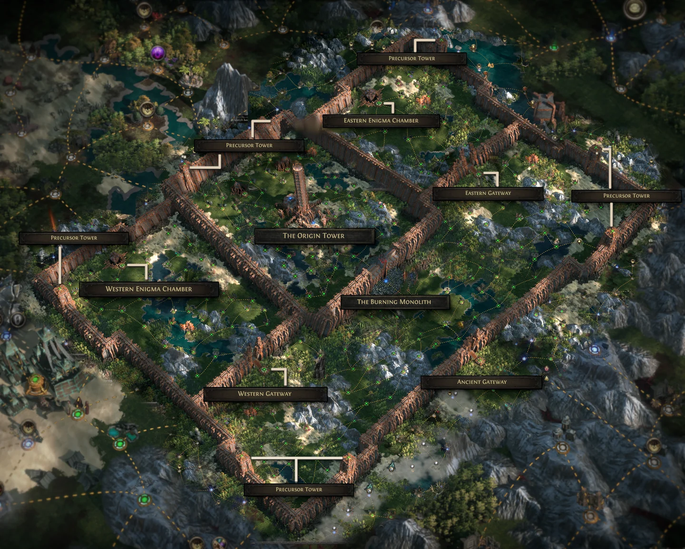
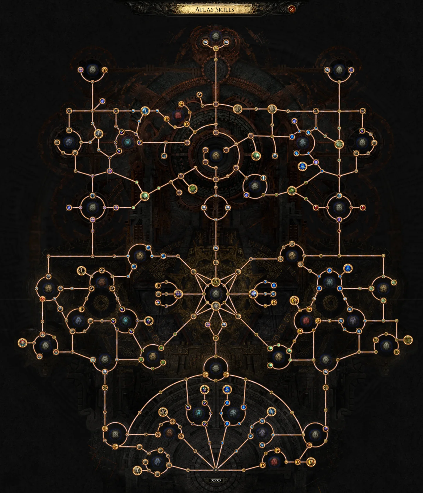
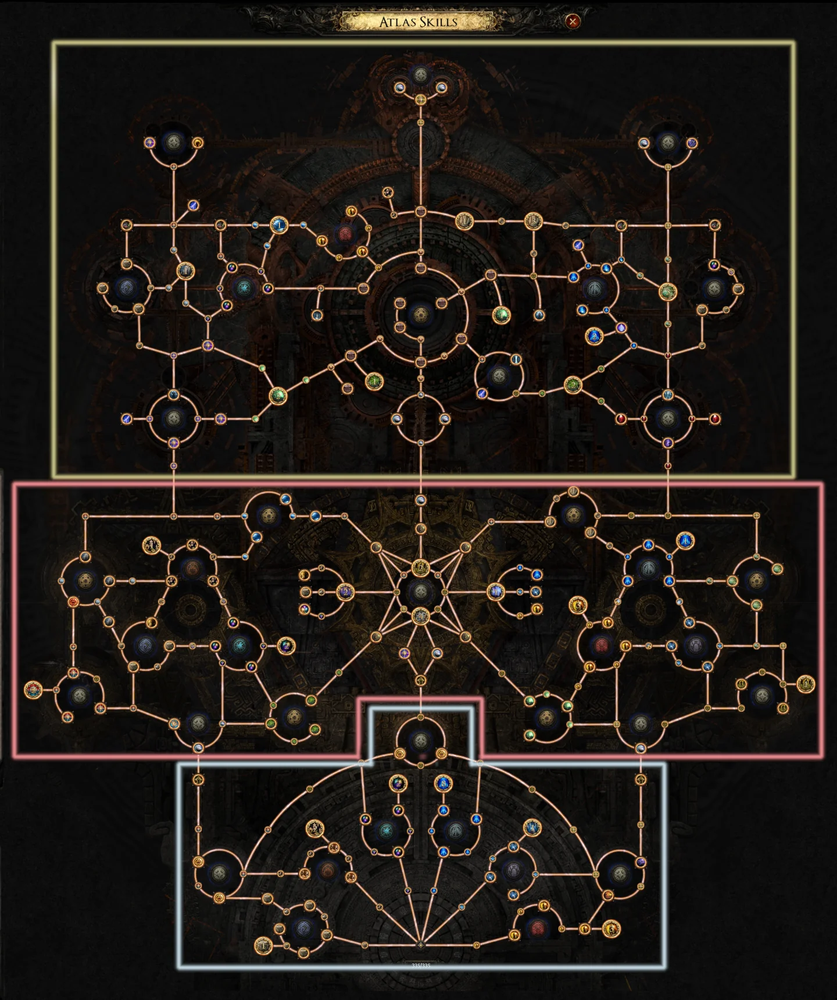
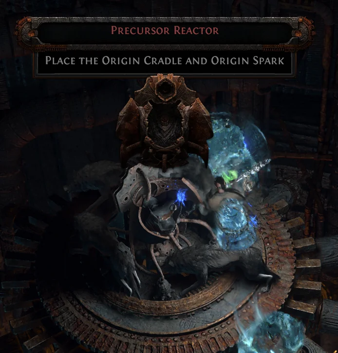
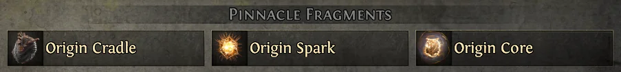
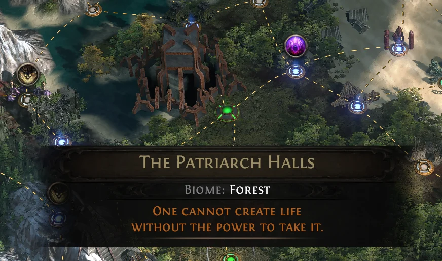

Phá đảo campaign _Path of Exile 2_ xong, mở bản đồ endgame ra thấy nguyên cái pháo đài to đùng rồi đứng hình — quen không mấy ông? Ngồi xuống uống miếng nước rồi nghe nè: **Fortress** chính là chỗ anh em gom **Atlas Passive Point**, và cây Atlas full ăn tới **335 điểm**. Bài này là lộ trình từ lúc bước qua cổng cho tới lúc hạ Pinnacle Boss cuối, kèm mấy chỗ dễ rớt điểm nhất.

<strong>Nguyên tắc quan trọng:</strong> Fortress đi theo mạch, không nhảy cóc được. Cây Atlas cũng mở theo 3 mảng gắn với 3 cột mốc boss — muốn cắm sâu vào một cơ chế nào đó thì phải hạ boss mở khoá trước, không có đường tắt.

## Fortress có gì — hai tầng, một mạch đi

_Cả cái Fortress nằm gọn trong một tấm: cổng vào, hai Gateway, Burning Monolith ở tầng 1; Enigma Chamber và Origin Tower ở tầng 2._

### Tầng 1 — nơi anh em đặt chân xuống

-   **The Ancient Gateway** — cổng vào, mở khu Fortress đầu tiên.

-   **Western Gateway** và **Eastern Gateway** — hai map đặc biệt, mỗi map một con boss cứng. Mỗi bên rơi **một trong hai Fragment** cần để mở cửa đánh Arbiter of Ash. Thiếu một cái là khỏi đánh.

-   **The Burning Monolith** — đấu trường của **Arbiter of Ash**, Pinnacle Boss đầu tiên trong đời nhiều anh em.

### Tầng 2 — sân chơi của dân lì đòn

-   **Western Enigma Chamber** và **Eastern Enigma Chamber** — hai map chứa boss phụ bắt buộc. Hạ xong mới có **Origin Cradle** và **Origin Spark**.

-   **The Origin Tower** — đấu trường của **Arbiter of Divinity**, trùm cuối của cả cụm Fortress.

## Lộ trình 6 bước, làm đúng thứ tự là xong

1.  Qua **The Ancient Gateway** để mở khu Fortress đầu tiên, rồi clear các map thường trong khu — mỗi map ăn điểm Atlas.

2.  Đánh **Western Gateway** và **Eastern Gateway**, gom đủ **2 Fragment**.

3.  Vào **The Burning Monolith** hạ **Arbiter of Ash**. Đây là mốc mở mảng thứ hai của cây Atlas.

4.  Leo lên tầng 2, clear **hai Enigma Chamber** để lấy **Origin Cradle** + **Origin Spark**.

5.  Mang hai món đó lên **The Origin Tower** hạ **Arbiter of Divinity**.

6.  Quay lại vét **Precursor Tower** — bước này 9/10 anh em quên, đọc kỹ phần dưới.

## Cây Atlas mở dần theo 3 mảng

_335 điểm nhìn thì đã mắt, nhưng cắm hết cả đời không xong đâu mấy ông._

-   **Mảng 1** — có ngay từ đầu, phục vụ khu Waystone.

-   **Mảng 2** — mở sau khi hạ **Arbiter of Ash**, áp cho khu **Area Level 70+**.

-   **Mảng 3** — mở sau khi clear boss **Enigma Chamber**, áp cho khu **Area Level 75+**.

Phần điểm còn lại rơi vào tay anh em sau khi hạ **Arbiter of Divinity**.

_Ba mảng tô riêng cho dễ nhìn — mỗi mảng gắn với một cột mốc boss, không hạ boss thì cứ nhìn từ xa thôi._

Về nội dung, cây Atlas phủ gần như trọn bộ cơ chế trong game: **Essences**, **Strongboxes**, **Azmeri Wisps**, **Rogue Exiles**, **Summoning Circles**, **Shrines**, **Precursor Tablets**, cộng thêm **Rarity** chung và các bonus cho Waystone theo **Biome**. Một số **Keystone** còn cho anh em chọn giữa nhiều nhánh chứ không phải bật/tắt một chiều.

<strong>Cenix mách nhỏ:</strong> Chà, quyết định khó quá, làm sao để tốt cho cả hai? Thật ra không cần chọn cả hai — 335 điểm nghe to nhưng chia cho từng đó cơ chế thì mỏng lắm. Chốt trước 1–2 cơ chế mà build của anh em ăn được nhiều nhất rồi dồn hết vào đó, đừng rải đều mỗi chỗ vài điểm.

## Ba chỗ dễ rớt điểm nhất

### 1. Precursor Tower — mỗi cái 4 điểm

Mấy cái tháp này nằm ở **rìa và các góc** của Fortress, mỗi cái có mini-boss riêng và trả **4 điểm Atlas Passive**. Vấn đề nằm ở chỗ: hạ **Arbiter of Divinity** sẽ tự động clear toàn bộ map trong một khu của Fortress — **trừ Precursor Tower**. Nghĩa là nếu anh em không tự tay leo tháp thì mấy điểm cuối cùng để hoàn thiện cây Atlas cứ nằm đó mãi.

### 2. Pinnacle Boss — 6 điểm trở lên mỗi con

Đây là nguồn điểm nặng ký nhất tính theo đầu boss. Riêng **Arbiter of Divinity** thì hào phóng khỏi bàn: mỗi lần hạ thường trả về **hơn 40 điểm** một lượt.

### 3. Site of the Chosen — Mote of Power

Chỗ này có cơ chế lạ nhất Fortress. **Mỗi league chỉ đúng một nhân vật Level 100** được phép hiến tế chính mình tại đây — đổi lại, **toàn bộ người chơi khác trong league** nhận thêm một Passive Skill Point. Phần anh em còn lại chỉ cần tới nhặt **Mote of Power** là ăn buff vĩnh viễn đó.

Một khi đã máu thì đừng hỏi bố cháu là ai nữa — nhưng thôi, cứ để người khác hiến tế, mình đi nhặt Mote là được rồi.

## Farm lại Arbiter of Divinity để vét nốt điểm

Hạ một lần chưa đủ 335 điểm đâu. Muốn đánh lại con này, anh em cần nạp nguyên liệu vào **Precursor Reactor** đặt dưới chân **Origin Tower**:

_Đây là cái lò nạp nguyên liệu, nằm ngay chân Origin Tower._

### Chơi Trade League

Ra thẳng **Currency Exchange** mua **Origin Spark** + **Origin Cradle**, hoặc gọn hơn là một viên **Origin Core**. Đây là đường nhanh nhất, thích đánh bao nhiêu lần cũng được, miễn ví chịu nổi.

_Hai món cần mua: Origin Spark và Origin Cradle._

### Chơi SSF

Không có chợ thì phải tự đi. Lặn vào **Atlas vô hạn** tìm **Patriarch Hall** và **Matriarch Hall**, hạ boss trong đó để tự rơi ra nguyên liệu. Cực hơn nhiều, nhưng đó là cái giá của dân SSF.

_Patriarch Hall và Matriarch Hall nằm rải trong Atlas vô hạn — dân SSF chịu khó lặn tìm._

<strong>Cảnh báo:</strong> Sau mỗi lần hạ Arbiter of Divinity, hãy rà lại bản đồ Fortress xem còn Precursor Tower nào chưa clear không. Boss clear hộ anh em cả khu nhưng chừa đúng mấy cái tháp — và đó lại là chỗ giữ những điểm cuối cùng.

## Tóm gọn cho ông nào lười đọc

-   Fortress = nơi kiếm Atlas Passive Point, tối đa **335 điểm**.

-   Tầng 1: 2 Gateway lấy 2 Fragment → Burning Monolith hạ **Arbiter of Ash**.

-   Tầng 2: 2 Enigma Chamber lấy **Cradle + Spark** → Origin Tower hạ **Arbiter of Divinity**.

-   Map thường 1 điểm, **Precursor Tower 4 điểm**, Pinnacle Boss **6+ điểm**, Arbiter of Divinity **40+ điểm**.

-   Farm lại boss cuối bằng Precursor Reactor: Trade thì mua ở Currency Exchange, SSF thì cày Patriarch/Matriarch Hall.

-   Đừng quên **Precursor Tower** và **Mote of Power** ở Site of the Chosen.

Rồi đó, hôm nay không cày hôm nào cày? Anh em nào đã hạ được Arbiter of Divinity rồi thì khoe cái build ở phần bình luận cho Cenix ngó với — và nói luôn là mấy ông dồn điểm Atlas vào cơ chế nào: Essence, Strongbox hay Precursor Tablet? Cenix đang phân vân chưa biết chốt hướng nào.

*Nguồn: [Mobalytics](https://mobalytics.gg/poe-2/guides/endgame-fortress)*
