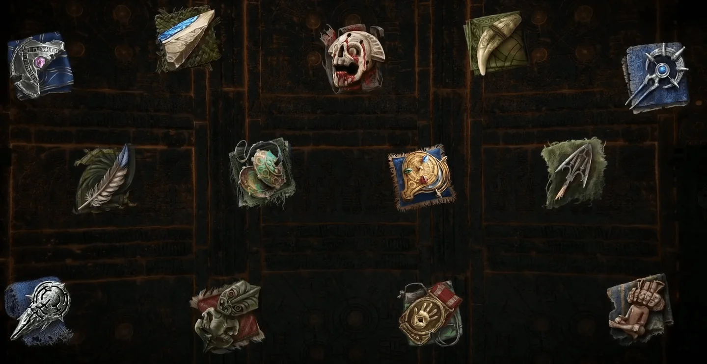
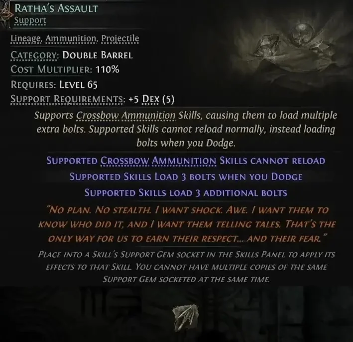
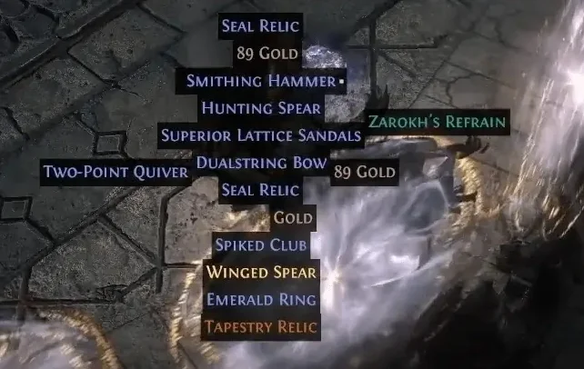
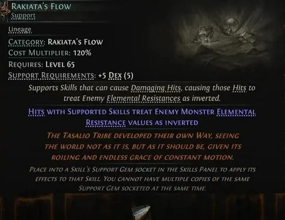
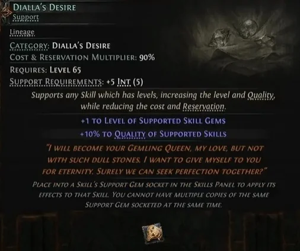
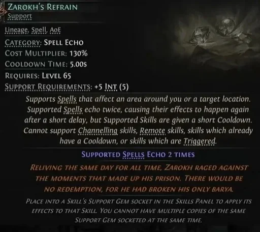

Endgame _Path of Exile 2_ có thêm một dòng đồ đáng săn mà nhiều anh em chưa để ý: **Lineage Support Gem**. Khoảng **40 viên**, cắm như support gem bình thường nhưng thuộc hẳn một đẳng cấp khác. **Dreamcore** tổng hợp lại, Cenix dịch cho anh em.

## Khác gì support gem thường?

Support thường thì anh em lấy từ **Uncut Support Gem**, ai cũng có. Lineage thì khác hẳn — đây là **đồ chase endgame**, cho những bonus mạnh và thường rất **kén, rất tình huống**, mạnh tới mức **mở ra được cả build mới**.

Nhưng có một luật xuyên suốt cần nhớ:

> Lineage cho bonus vượt trội so với support thường, nhưng thường kèm một mặt trái đáng kể.

Ví dụ dễ hiểu nhất là **Ratha's Assault** — buff cho nỏ na ná Double Barrel Support, đổi lại **mất luôn khả năng nạp đạn theo cách bình thường**.

<strong>Đọc kỹ mặt trái trước khi cắm:</strong> Đây không phải kiểu gem "cắm vào là mạnh hơn". Mỗi viên là một sự đánh đổi — cắm mà không tính trước cách gánh mặt trái thì build còn yếu hơn lúc dùng support thường.

## Kiếm ở đâu?

Có đúng hai đường:

-   **Rơi ngẫu nhiên toàn cục** — từ nội dung endgame nói chung.

-   **Rơi độc quyền từ boss** — gắn với từng trận cụ thể: **Pinnacle Boss**, **Anomaly Boss**, và **Large Abyssal Trove**.

Bài gốc của Dreamcore có bảng đủ **40 viên** kèm nơi rơi của từng viên — anh em nào săn viên cụ thể thì ghé đó tra.

## Ba viên đáng chú ý nhất

### Rakiata's Flow

**Đảo ngược kháng nguyên tố của quái** đối với sát thương mà kỹ năng được hỗ trợ gây ra bằng đòn Hit. Nghe qua là hiểu vì sao viên này được nhắc tên — quái kháng càng cao thì càng ăn đòn.

### Dialla's Desire

Cộng **cấp gem**, cộng **quality**, kèm hệ số nhân cost/reservation. Viên này thiên về nâng thẳng sức mạnh của kỹ năng.

### Zarokh's Refrain

Khiến spell được hỗ trợ **Echo nhiều lần**. Viên này **chỉ rơi từ boss Zarokh**, không có đường nào khác.

## Cenix nói thật một câu

Bài gốc của Dreamcore tập trung giới thiệu cơ chế và bảng nguồn rơi, **chưa có phần xếp hạng viên nào mạnh nhất cho build nào**, cũng chưa nói rõ giới hạn cắm bao nhiêu viên một nhân vật. Nên anh em đừng vội ôm một viên chỉ vì thấy tên nghe ngầu — đọc kỹ dòng mặt trái, đối chiếu với build đang chơi rồi hãy quyết.

Chà, quyết định khó quá, làm sao để tốt cho cả hai? Ở đây thì không có "cả hai" đâu — được cái này là mất cái kia, đó là bản chất của Lineage.

## Tóm gọn cho ông nào lười đọc

-   Khoảng **40 viên** Lineage Support, là đồ chase endgame chứ không phải support thường.

-   Mạnh hơn support thường, nhưng **viên nào cũng có mặt trái**.

-   Kiếm từ **rơi ngẫu nhiên endgame** hoặc **boss độc quyền** (Pinnacle Boss, Anomaly Boss, Large Abyssal Trove).

-   Ba viên đáng chú ý: **Rakiata's Flow** (đảo kháng quái), **Dialla's Desire** (+cấp gem, +quality), **Zarokh's Refrain** (spell echo, chỉ từ boss Zarokh).

Anh em đã nhặt được viên Lineage nào chưa — mà nhặt rồi có dám cắm không, hay để đó ngắm vì sợ mặt trái? Kể Cenix nghe với, biết đâu có ông đang ôm Zarokh's Refrain mà chưa biết dùng.

*Nguồn tham khảo: [Mobalytics — Dreamcore](https://mobalytics.gg/poe-2/guides/lineage-support-gems)*
