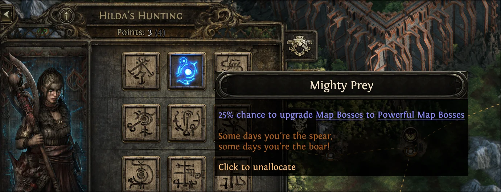
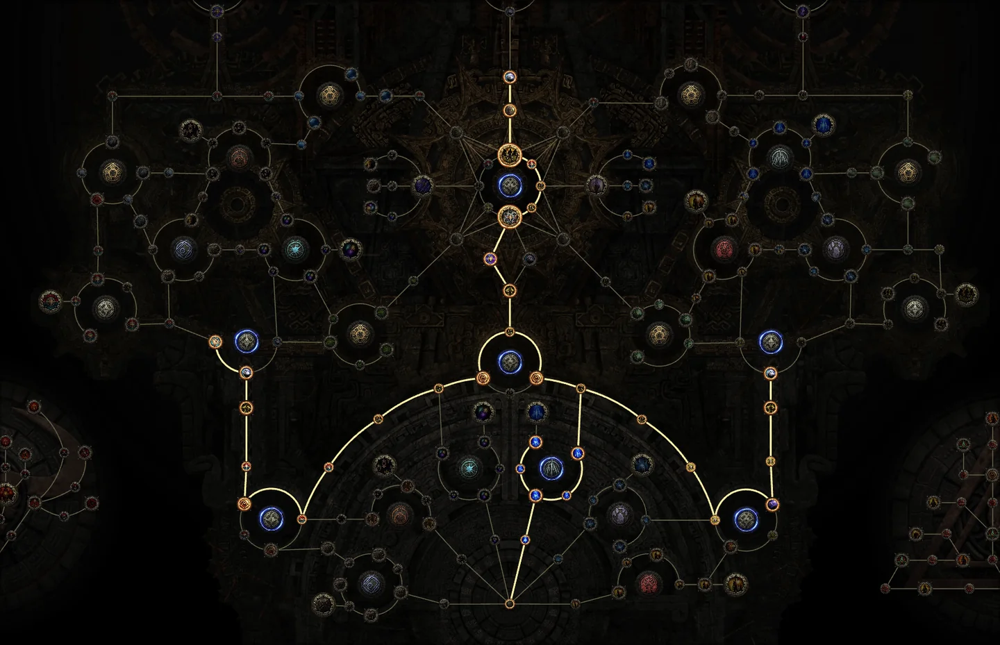
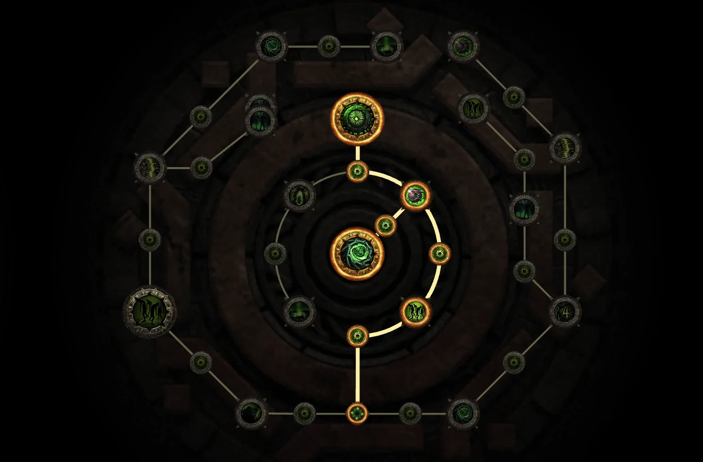
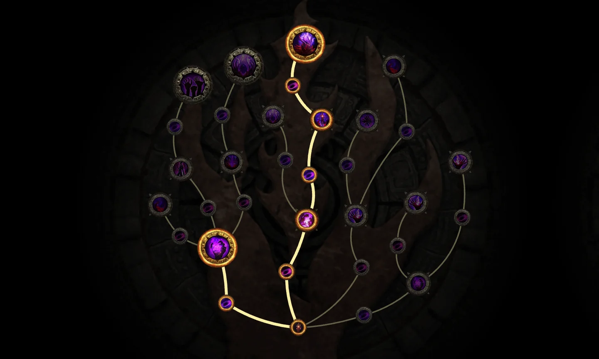
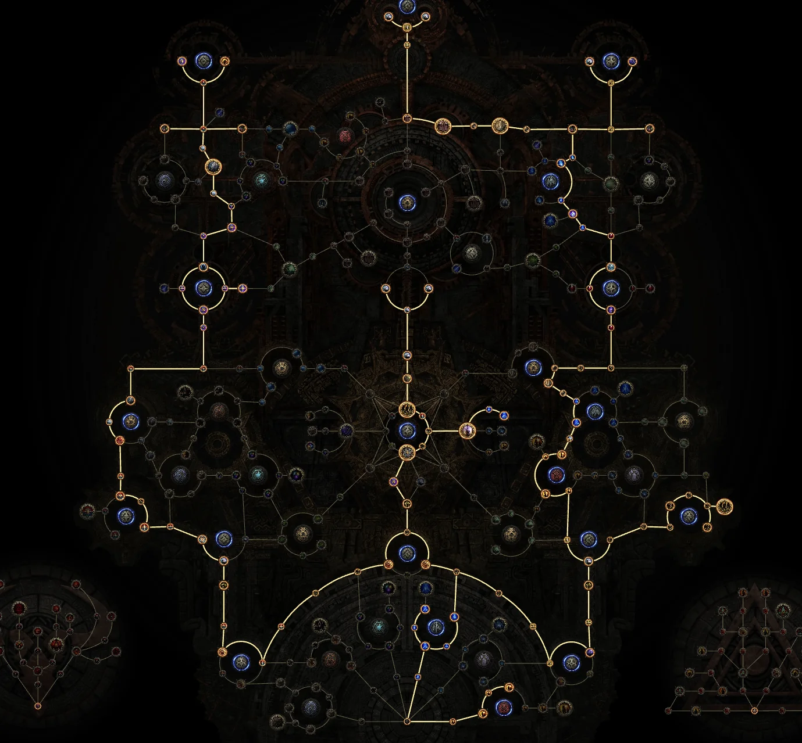
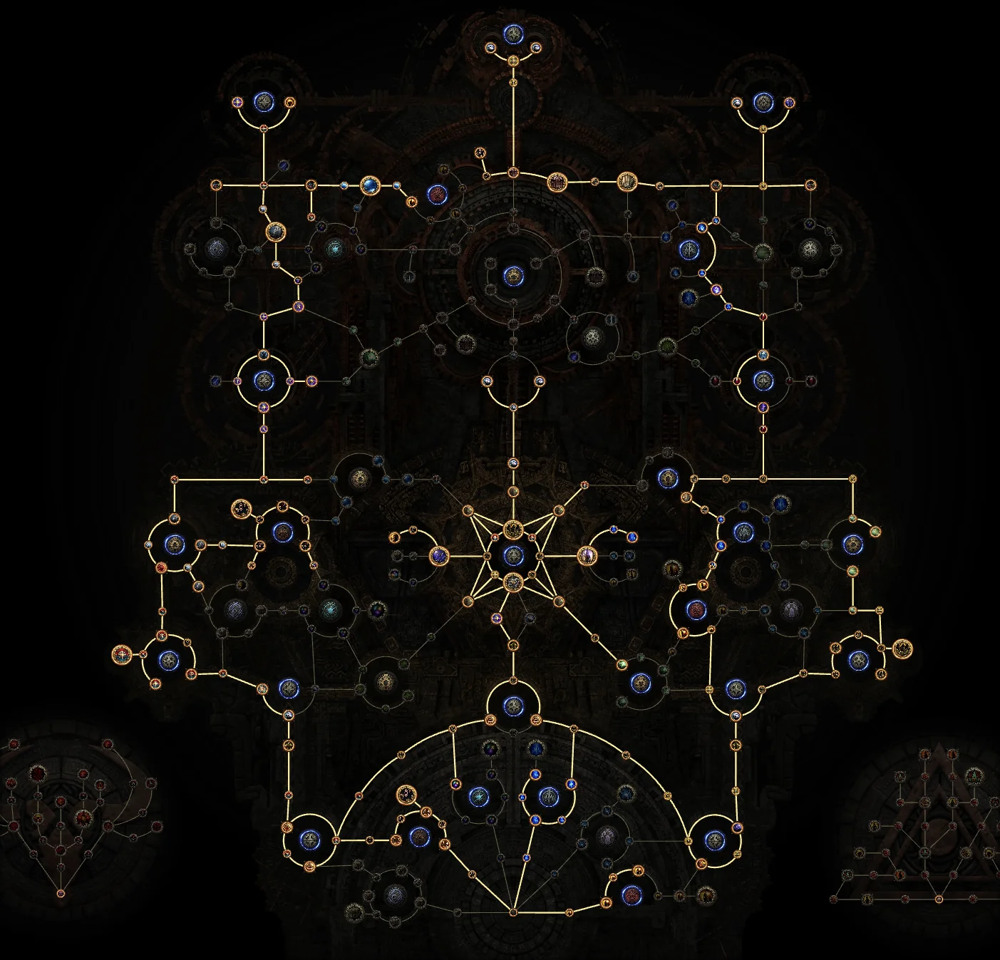
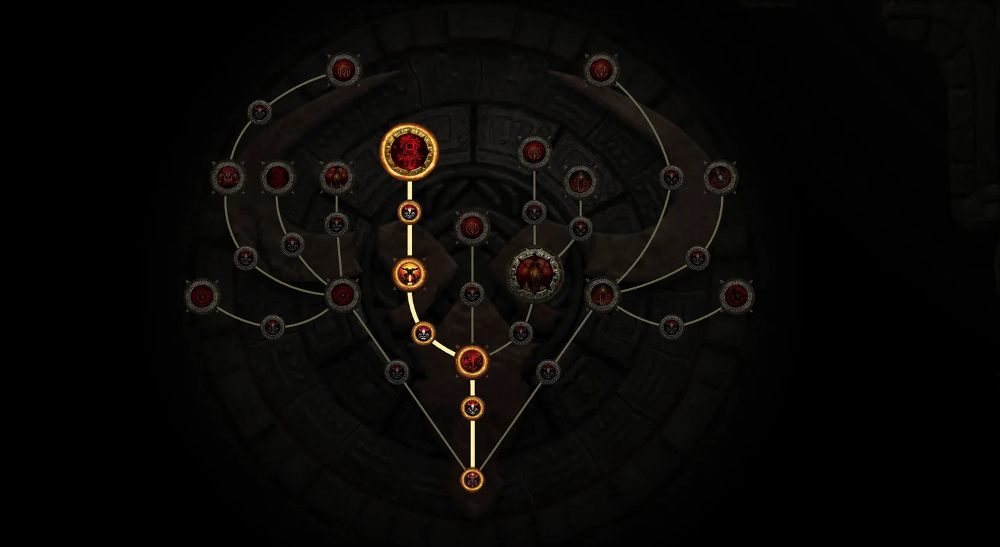
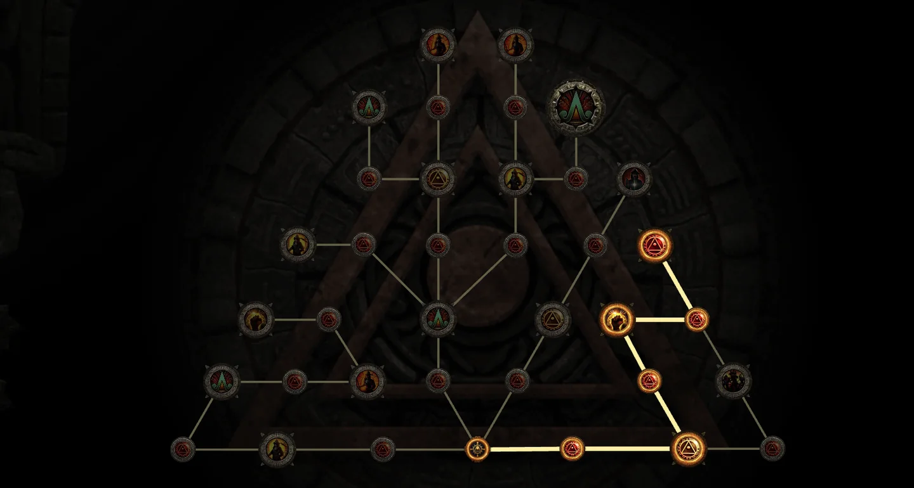
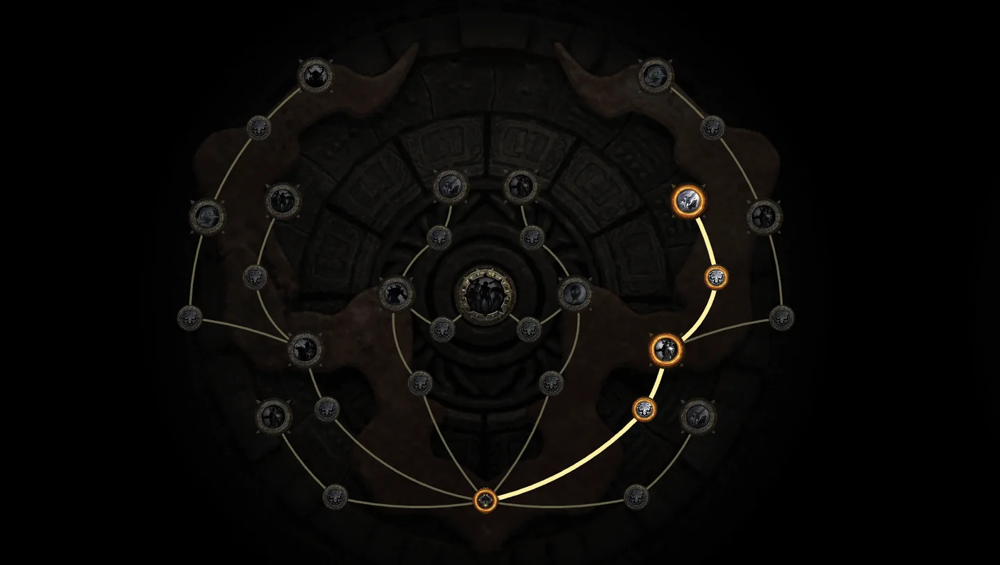

Phá đảo chiến dịch _Path of Exile 2_ xong là bước vào endgame, và đây là chỗ nhiều anh em lạc đường nhất: mở Atlas ra thấy cái gì cũng muốn làm, làm tùm lum rồi cuối cùng phải quay đầu cày lại. Lộ trình dưới đây do **Asmodeus** vạch, chia đúng 5 giai đoạn, đi theo là hết cảnh backtrack.

<strong>Đọc kỹ trước khi cắm điểm:</strong> Path of Exile 2 hiện <strong>KHÔNG cho respec cây Atlas</strong>. Cắm sai là sống chung với nó cả mùa. Đó là lý do thứ tự trong bài này quan trọng hơn anh em tưởng.

Triết lý xuyên suốt của Asmodeus gói gọn một câu:

> Luôn lao thẳng tới boss trong lúc đi Atlas.

Thời gian dành cho nội dung có thưởng lớn, đừng nướng vào việc cày cơ chế khi bản thân còn dưới trình.

## Giai đoạn 1 — Mở đường và đủ Waystone mà đi

### Việc phải làm ngay

1.  Clear map chiến dịch đầu tiên, lao thẳng tới boss.

2.  Nói chuyện với **Doryani** và **Farrow** ở Ziggurat.

3.  Ghé **Hilda's Camp**, làm một **Beast Contract** để mở passive **25% cơ hội nâng boss map thường lên Powerful**.

_Passive của Hilda — làm sớm một Beast Contract là có, rẻ mà lời._

### Nuôi Waystone kiểu không bao giờ hết bài

-   Luôn chạy waystone bậc cao nhất đang có trong tay.

-   Mua map dự phòng từ NPC ở đúng ba mốc: **tier 6, tier 11, tier 14** — mua trước khi đẩy tiếp.

-   Đừng chạy những node map không cần thiết: chỉ đi đường ngắn nhất tới mục tiêu nhiệm vụ.

### Tuyến đi trong Fortress

**Ancient Gateway** → **Burning Monolith** → nhặt chìa **Trial of Sekhemas** (lên **cấp 70** để lấy ascendancy thứ 3) → **East Gateway** hạ **Precursor Refiner** → **West Gateway** hạ **Precursor Separator** → **Enigma Chamber** (cần waystone **Tier 10**) lấy **Crisis Fragment** → quay lại **Burning Monolith** đánh **Arbiter of Ash**.

### Thứ tự cắm điểm Atlas giai đoạn 1

1.  Nhóm **Essence** → **Pathkeepers** (tăng rơi waystone)
2.  **Eons of Domination** (mở Overseer Tablet)
3.  **Valuable Paths**
4.  **The Chosen Path: Essences**
5.  **The Journey Ahead: Monster Effectiveness**
6.  **Archaeological Interest**
7.  **Expanding Hordes**
8.  **Atop the World** (Precursor Tablet chung)
9.  **Nemesis Rising: Effectiveness** — nếu còn dư điểm

_Cây Atlas sau giai đoạn 1 trông như vầy — chưa đẹp nhưng đủ để nuôi waystone._

## Giai đoạn 2 — Đứng lại ở Tier 11 mà xây người

Đây là lời khuyên đáng giá nhất cả bài, và cũng là chỗ nhiều anh em nôn nóng nhất.

**Waystone Tier 11 cho đồ iLvl 75** — đủ để ra:

-   Sát thương phẳng **Tier 1** (nhẫn, găng)
-   Máu **Tier 1–2**
-   Kháng và phòng thủ **Tier 2**
-   Amulet **+3**
-   Sát thương vật lý vũ khí **Tier 2**
-   Gem **cấp 18**

> Tier 15 khó hơn hẳn nhưng phần thưởng gần như y hệt Tier 11.

Nghĩa là đẩy lên Tier 15 khi đồ còn mỏng chỉ tổ chết nhiều, chứ chẳng giàu thêm bao nhiêu.

### Làm gì trong lúc đứng ở Tier 11

1.  **Điểm Master của Doryani** — clear nexus vùng nhiễm gần đó, cắm **+1 Revival**.

2.  **Delirium phần 1** — đi tới **Withered Willow**, giết **5 boss** khi sương còn hiệu lực, cắm passive *"I know your childhood fears..."*, rồi cày liquid emotion qua gương delirium.

3.  **Abyss** — đi tới **Well of Souls**, đóng abyss ở góc trên, dưới và phải, hạ boss cuối **Kulemak**. **Tránh dùng Abyss Tablet**. Ưu tiên passive **Balance of Power: Ulaman**.

_Nhánh Abyss — nhớ né tablet Abyss trong lúc đang mở khoá chính nó._

4.  **Breach** — đi tới **Monastery of the Keepers**, xong **Breach Hive** và **Colony**, hạ **Xesht**. **Tránh dùng Breach Tablet**. Ưu tiên **Breeding Program: Banded Fruit** và **Diverse Control**.

_Nhánh Breach, cùng nguyên tắc: đang mở khoá thì đừng chạy tablet của nó._

5.  **Chuẩn bị cuối** — lên **cấp 85+**, cày Tier 11 để kiếm **Barya 4 trial** cấp thấp nhất, xong ascendancy thứ 4.

<strong>Lưu ý dễ bỏ qua:</strong> Đừng chạy tablet của chính cơ chế mà anh em đang đi mở khoá. Còn Overseer Tablet thì cứ transmute rồi augment thoải mái để ăn thêm mod rơi waystone.

## Giai đoạn 3 — Săn trùm Pinnacle

Tìm **Matriarch Hall** và **Patriarch Hall** — dấu hiệu nhận biết là **luồng sáng cam mượt**. Hạ cả hai để lấy **Origin Cradle** và **Origin Spark**, mang cả hai vào **Engine Room** dưới chân **Origin Tower** để đổi lấy **Origin Core**, rồi leo tháp hạ **Arbiter of Divinity**.

Xong xuôi thì dùng **Cardinal Device** ở góc dưới bên trái — nó tự hoàn thành khoảng **40 map** mỗi vùng cho anh em.

### Điểm Atlas giai đoạn 3

**Reverse Transcription**, **Competing Explorers / Competitive Archaeology**, **Mountain Mastery: Tablets**. Sau đó rẽ nhánh:

-   **Nhánh trên trái**: Risk and Reward, Enigmatic Intensification, Memories of Vaal/Maraketh
-   **Nhánh trên phải**: Controlled Climates, Hard-Won Treasures, Memories of Ezomytes/Karui
-   **Nhánh trên cùng**: Curiously Durable Stone, Partial Translation

Đám passive phía trên này scale mod của waystone và tablet — đây là chỗ biến map thường thành map ra đồ.

_Tới giai đoạn 3 thì cây bắt đầu ra dáng, ba nhánh phía trên là chỗ ăn tiền._

## Giai đoạn 4 — Vét Fortress 100%

Kết hợp việc mở rộng theo tuyến Doryani với việc săn Matriarch/Patriarch:

-   Cắm cây Doryani: **Stitch the Flesh**, **Hidden Patterns**, **Remnants of the Greatness**, và chọn một trong hai — **Map Irradiation** hoặc **Volatile Connection**.
-   Từ Fortress toả ra ngoài bằng các tháp tường.
-   Clear vùng nhiễm — sau nexus thứ 3 chắc chắn ra boss **Immured Fury**.
-   Để dành tablet có tỉ lệ rơi waystone cao cho boss ở Hall.
-   Lặp vòng **Arbiter of Divinity 5 lần**.
-   Điểm dư cắm vào nhóm chung: quái Magic/Rare, Item Rarity, Pack Size.

_Và đây là đích đến: cây Atlas cắm kín sau giai đoạn 4._

## Giai đoạn 5 — Dọn nốt nội dung phụ

### Ritual

Đi **Caer Tarth**, nộp tribute lấy **An Audience With The King**, dùng thư mời ở **Crux of Nothingness**, hạ **King in the Mists**, đặt đầu vào effigy, chạy 5 map rồi hạ **Bodach**. Ưu tiên **Reborn in Shadow**, **From the Mists**, **Invigorated Sacrifices: Attrition**.

### Vaal Temple

Đi **Vaal City**, xây một con đường thẳng để chống instability, nối **Architect** với **Atziri's Royal Chambers**, hạ Architect rồi tới Atziri. Ưu tiên **Offerings to the Queen**, **Military Reinforcements**, **Loyal Gatekeepers**.

### Delirium phần 2

Đi **Grand Mirror**, chạy map cho sương phủ **100%**, xong **Simulacrum** (trận **7 màn**), lấy **Raven's Reflection**, rồi hạ **Tangmazu** ở Withered Willow.

### Nhiệm vụ Master và Expedition

**Hilda**: tìm và hạ **3 Great Beast** còn lại. **Jado**: tìm **Sealed Vault**, **Jade Isles**, **Derelict Mansion**, **Sacred Reservoir**. **Expedition**: theo chuỗi logbook Kingsmarch, hạ **Medved**, **Vorana**, **Uthred**, **Olroth**, rồi mang **Triskellion Flame** tới miệng hố.

<strong>Đừng hoảng:</strong> Có những passive Atlas anh em bấm mãi không được. Không phải lỗi game — nhiều điểm chỉ mở sau khi hạ đúng con boss tương ứng. Cứ đi tiếp theo lộ trình, tới lúc là nó sáng.

## Ba lỗi khiến anh em mất cả tuần

-   Nhảy vọt lên **Tier 15** khi đồ chưa tới — chết nhiều mà thưởng chẳng hơn Tier 11.
-   Chạy tablet của đúng cơ chế mình đang mở khoá.
-   Cắm điểm Atlas theo cảm hứng — nhớ là **không respec được**.

Rồi đó, hôm nay không cày hôm nào cày? Anh em đang kẹt ở giai đoạn mấy — còn loay hoay Tier 11 hay đã sờ tới Arbiter of Divinity rồi? Kể Cenix nghe với.

*Nguồn tham khảo: [Mobalytics — Asmodeus](https://mobalytics.gg/poe-2/guides/endgame-progression-asmodeus)*
