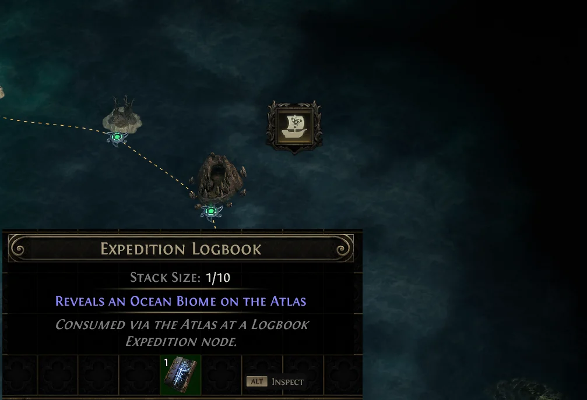
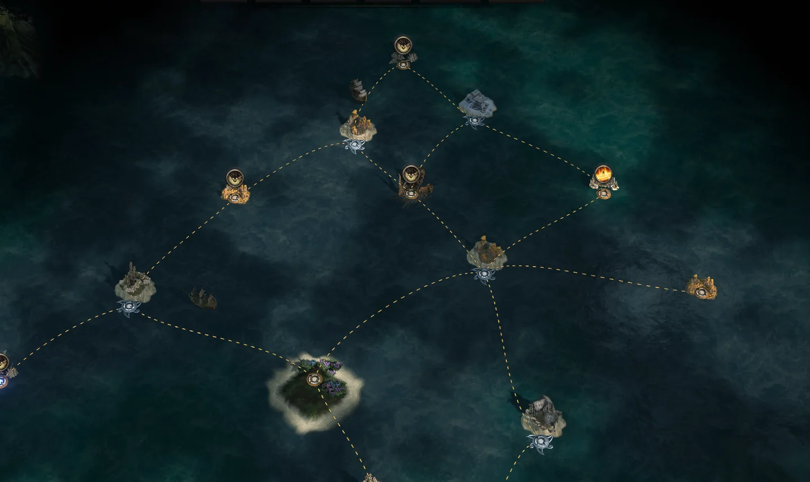
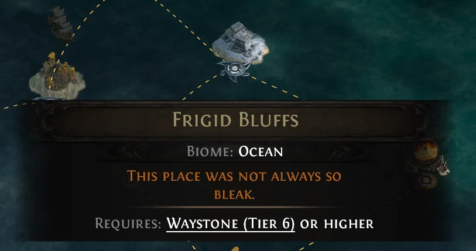

Hội anh em cày PoE 2 ở Việt Nam gọi cái này là **"lặn biển"** — mở bản đồ Atlas thấy mấy cái biểu tượng thuyền, bấm vào là ra một chuỗi map kèm mấy trận **Grand Expedition** đầy đồ. Nghe thì sướng, nhưng muốn lặn được thì phải qua cửa **Ruins of Kingsmarch** cái đã. Ngồi xuống uống miếng nước rồi nghe nè, Cenix dẫn anh em đi từng chặng.

<strong>Tìm chỗ bắt đầu:</strong> <strong>Ruins of Kingsmarch</strong> nằm ở phía <strong>đông nam</strong> của <strong>Ziggurat Refuge</strong>. Đây là nội dung endgame, tên chính thức của chuỗi quest là <strong>The Grand Expedition</strong>.

## Mở màn — gặp mặt cho đủ người

Quay về **Ziggurat Refuge** nói chuyện với **Doryani** và **Farrow**, rồi tới **Ruins of Kingsmarch** gặp **Dannig**. Chuỗi này xoay quanh câu chuyện của **Gwennen** — vợ của **Rog** — nên anh em sẽ còn gặp lại cả nhà này dài dài.

Nói trước cho anh em chuẩn bị tinh thần: chuỗi quest đầy đủ có tới **84 bước**. Nghe hoảng nhưng thật ra chia thành mấy chặng rất gọn, Cenix gom lại dưới đây.

## Chặng chính — bốn quyển logbook, bốn con boss

Đây là phần chiếm gần hết thời gian. Anh em lần lượt nhận và dùng **bốn quyển logbook**, mỗi quyển dẫn tới một hòn đảo:

| Logbook | iLvl | Boss ở cuối |
|---|---|---|
| **Makoru's Logbook** | 65 | **Medved, the Fallen Seer** |
| **Vorana's Logbook** | 65 | **Vorana, Last to Fall** |
| **Uhtred's Logbook** | 65 | **Uhtred, the Stardrinker** |
| **Olroth's Logbook** | 65 | **Olroth, Origin of the Fall** |

### Bốn bước lặp lại ở mỗi hòn đảo

1.  **Thăm dò đảo** để tìm người dẫn đoàn thám hiểm.

2.  **Đặt và kích nổ** thuốc nổ.

3.  **Vào hầm mộ** vừa lộ ra.

4.  **Hạ con boss** trấn giữ.

Bốn hòn đảo, bốn lần lặp lại đúng quy trình đó. Làm quen tay ở đảo đầu thì ba đảo sau chạy rất nhanh.

<strong>Cenix mách nhỏ:</strong> Bốn con boss này về sau vẫn gặp lại trong Grand Expedition thường — <strong>Medved</strong>, <strong>Vorana</strong>, <strong>Uhtred</strong> và <strong>Olroth</strong> đều có "tin đồn" riêng để triệu ra. Nên lần đầu đánh cứ nhớ kỹ bài của từng đứa, về sau đỡ mất máu.

## Chặng cuối — ra khơi bằng tàu Aurora May

Xong bốn đảo, anh em thu về **Shattered Triskelion** — mảnh vỡ của **Triskelion Flame**. Phần còn lại:

1.  Lên tàu **Aurora May** đi tới **Verisium Crater**.

2.  Dùng **Triskelion Flame** để phá lớp rào chắn.

3.  Điều tra **thiên thạch** rơi xuống miệng hố.

4.  Hạ **the Aberration** — con cuối cùng của cả chuỗi.

Hoàn thành thì anh em cầm trong tay **The Triskelion Reforged**, và quan trọng hơn: **tính năng lặn biển chính thức mở**.

## Lặn biển là gì và mở ra rồi thì làm gì

Từ đây trở đi, trên Atlas anh em sẽ thấy biểu tượng thuyền **"Uncharted Waters"**. Bấm vào nó thì:

-   **Tiêu một quyển Logbook** trong túi đồ.
-   Mở ra **một chuỗi map** gồm map thường cộng với **vài trận Grand Expedition**.

Grand Expedition chính là chỗ ra đồ. Mỗi trận là một khu rộng, anh em đặt chuỗi thuốc nổ rồi kích một phát, quái với rương đồ bung ra hàng loạt. Cách chạy và cách tối ưu để ăn đậm thì Cenix để dành cho bài riêng, bài này lo phần mở khoá trước đã.

## Tóm gọn cho ông nào lười đọc

-   Chuỗi quest tên **The Grand Expedition**, bắt đầu ở **Ruins of Kingsmarch**, đông nam **Ziggurat Refuge**.

-   Nói chuyện với **Doryani**, **Farrow**, rồi **Dannig**. Cốt truyện xoay quanh **Gwennen** — vợ **Rog**.

-   **Bốn logbook** (Makoru, Vorana, Uhtred, Olroth), mỗi quyển một đảo, mỗi đảo một boss.

-   Mỗi đảo làm đúng 4 việc: tìm người dẫn đoàn → đặt và nổ thuốc → vào hầm mộ → hạ boss.

-   Chặng cuối: gom **Shattered Triskelion** → tàu **Aurora May** tới **Verisium Crater** → phá rào → điều tra thiên thạch → hạ **the Aberration**.

-   Xong là mở **Uncharted Waters** trên Atlas — bấm vào tốn 1 Logbook, đổi lại một chuỗi map kèm Grand Expedition.

Rồi đó, hôm nay không cày hôm nào cày? Anh em nào đã mở được lặn biển rồi thì kể Cenix nghe kẹt lâu nhất ở con boss nào — Cenix đoán là Olroth, mà không biết có đúng không.

*Nguồn tham khảo: [Mobalytics — Lolcohol](https://mobalytics.gg/poe-2/guides/grand-expeditions-and-logbooks) · [PoE2DB](https://poe2db.tw/us/The_Grand_Expedition)*
