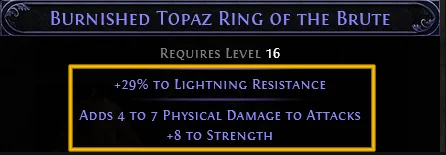
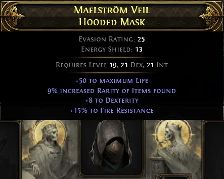
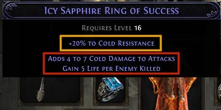
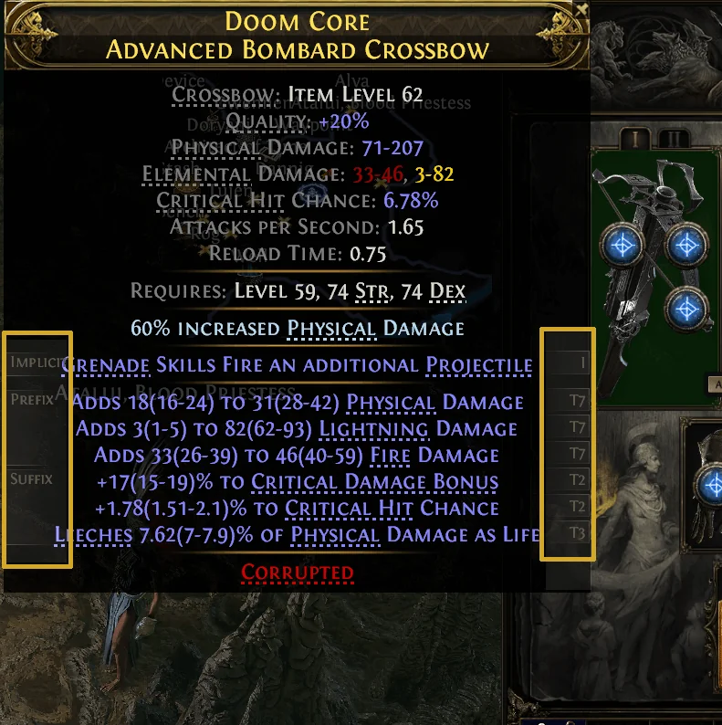
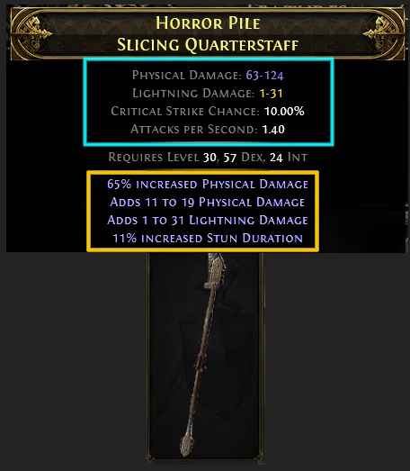

Muốn craft trong _Path of Exile 2_ mà nhảy vào đập currency luôn thì y như đi chợ mà không biết đọc bảng giá. **Lolcohol** mở đầu bài nhập môn bằng một câu rất chuẩn: trước khi động vào viên currency đầu tiên, phải dựng cho vững cái nền — tức là **đọc hiểu món đồ đang cầm trong tay**. Để Cenix kể cho nghe.

## Bốn độ hiếm, bốn giới hạn mod

-   **Normal (trắng)** — không có mod explicit nào.
-   **Magic (xanh dương)** — tối đa **2 mod** (1 prefix + 1 suffix).
-   **Rare (vàng)** — tối đa **6 mod** (3 prefix + 3 suffix).
-   **Unique (cam)** — hầu hết currency không đụng vào được, và có thể vượt quá 6 mod.

<strong>Hiểu nhầm phổ biến nhất:</strong> "tối đa" không có nghĩa là lúc nào cũng đủ. Món đồ Rare bị craft rớt bớt mod <strong>vẫn là Rare</strong> và vẫn giữ nguyên tiềm năng 6 mod — nó KHÔNG tụt xuống thành Magic. Nhiều anh em tưởng đồ rớt mod là hỏng rồi vứt, oan lắm.

## Implicit và Explicit

**Implicit** nằm ở trên cùng, là thứ gắn liền với loại đồ đó — ví dụ nhẫn Topaz thì luôn có kháng Sét. Currency **không đổi được** implicit. Không phải món nào cũng có.

**Explicit** nằm bên dưới, và đây mới là thứ thay đổi khi anh em đập currency. Toàn bộ chuyện craft xoay quanh đám này.

Còn một loại nữa là **Enchantment**, hiện chữ **xanh nhạt** phía trên implicit. Rune cắm vào socket chính là một cách tạo enchantment.

## Prefix và Suffix — ai thuộc phe nào

Game chia mod làm hai phe để không ai chất được quá nhiều mod cùng loại. Và vị trí thì cố định, học một lần dùng cả đời:

### Vũ khí

-   **Prefix**: % Increased Damage, Flat Damage, % Elemental Damage, % Spell Damage, Spirit, sát thương cho Ally, Accuracy.
-   **Suffix**: Attack/Cast Speed, chỉ số (Dex/Int/Str), Critical Hit Chance/Bonus, +cấp kỹ năng, Leech, hồi Life/Mana, tốc độ đánh của Ally.

### Giáp và trang sức

-   **Prefix**: Life, Mana, Spirit, chỉ số phòng thủ (Armour/ES/Evasion), **Movement Speed** (chỉ giày).
-   **Suffix**: các loại kháng (Sét, Lửa, Lạnh, Chaos), hồi Life/Mana, chỉ số.

Muốn xem thì **giữ Alt** rồi rê chuột — chữ xám nhỏ sẽ hiện tier (T7, T2...) và cho biết mod đó thuộc phe nào.

## Tier và Item Level — cặp bài trùng

**Tier** là mức mạnh yếu, **T1 là mạnh nhất**. Chênh lệch khủng khiếp: một mod Life tier thấp cho **10–20 Life**, tier cao cho **190–200 Life**. Mỗi mod có số tier khác nhau — Life có thể 10 tier, Strength chỉ 6.

**Item Level** quyết định tier nào được phép xuất hiện. Món giày iLvl 70 **không đời nào** roll ra mod của iLvl 82 — không phải xui, mà là luật.

Ba mốc đáng nhớ:

-   Kháng nguyên tố cao nhất **(+41–45%)** cần **iLvl 82+**.
-   Kháng Chaos cao nhất trên áo giáp cần **iLvl 81+**.
-   Movement Speed cao nhất trên giày cần **iLvl 82**; mức nhì cần **iLvl 70**.

<strong>Đừng phí Divine Orb:</strong> Tier có khoảng giá trị cố định của nó. Đập Divine lên một mod tier thấp thì cỡ nào cũng không vượt được trần của tier đó — tiền ném đi vô ích.

## Tag — cái nhãn dán sau lưng mỗi mod

Gần như mod nào cũng có **Tag** mô tả nó thuộc nhóm gì. "% increased Physical Damage" mang tag **Damage**, **Physical**, **Attack**. Kháng Lửa mang tag **Elemental**, **Fire**, **Resistance**. Xem bằng cách giữ Alt rồi rê vào số tier bên phải.

Tag từng cực quan trọng, nhưng từ bản 0.3 gỡ **Omen of Homogenising Exaltation** thì bớt nặng ký. Hiện chỉ còn **Omen of Catalysing Exaltation** dùng tới tag — nó khiến Exalted Orb ăn Catalyst Quality để tăng cơ hội ra mod cùng tag.

## Local và Global — chỗ dễ nhầm nhất

**Local** chỉ tác động lên chính món đồ đó. Dấu hiệu nhận biết: chỉ số gốc chuyển từ **chữ trắng sang chữ xanh**. Ví dụ "65% increased Physical Damage" trên vũ khí làm đổi luôn dòng Physical Damage của cây vũ khí.

**Global** tác động lên nhân vật, không lên món đồ. Đa số mod thuộc loại này: "+10 to Dexterity", "+50 to Maximum Life".

> "50% increased Global Hit Chance" khác hoàn toàn "50% to Critical Hit Chance" — cái sau chỉ tính cho cây vũ khí đó.

Chỗ hay hiểu sai nữa: mod global **không nhân lên**. Dòng "48% increased Evasion and Energy Shield" không biến 1.000 ES thành 1.480 — nó chỉ tăng chỉ số gốc của món đồ, rồi mới cộng riêng với bonus từ cây passive.

## Flat, Percent và Hybrid

-   **Flat** — con số cứng: "+50 to Maximum Life", "Adds 11 to 19 Physical Damage".
-   **Percent** — phần trăm: "65% increased Physical Damage".
-   **Hybrid** — gộp **hai chỉ số vào một dòng**, ví dụ "15–19% increased Physical Damage, +16–20 to Accuracy Rating".

Điểm quan trọng của Hybrid: nó **chỉ chiếm 1 ô** prefix/suffix chứ không phải 2. Nhưng đổi lại giá trị mỗi vế bị cắt bớt — mod T1 riêng lẻ cho tới "40–49% increased Physical Damage" và "+11–32 to Accuracy Rating", còn bản hybrid gộp cả hai với con số thấp hơn. Nếu món đồ có cả hybrid lẫn mod thường cùng loại, phần trăm sẽ cộng gộp khi hiện lên (thấy 120%) nhưng thực chất là 90% + 30% từ hybrid.

## Mod Pool và Base

Mỗi loại đồ có **mod pool** riêng — danh sách mod nó được phép ra. Chuỳ ra được Physical Damage, áo giáp thì không; ngược lại áo giáp ra được "10% increased Armour" mà chuỳ thì chịu.

Mỗi mod còn có **Weight** — trọng số quyết định nó dễ hay khó ra. Kháng nằm ở phe suffix, mà rare chỉ có 3 suffix, nên game tự nhiên chặn được chuyện chất kháng vô tội vạ.

**Base** là bất kỳ món đồ nào mặc được và craft được — thường hiểu là đồ trắng, nhưng không bắt buộc. Trừ Unique ra thì gần như món nào cũng craft được.

## Tóm gọn cho ông nào lười đọc

-   Rare tối đa **3 prefix + 3 suffix**; rớt mod vẫn là Rare.
-   **Implicit** không đổi được, **Explicit** mới là sân chơi của craft.
-   **T1 là mạnh nhất**; **Item Level** quyết định tier nào được ra.
-   Giữ **Alt** để xem tier và phe của từng mod.
-   **Local** đổi chỉ số món đồ (chữ hoá xanh), **Global** đổi chỉ số nhân vật.
-   **Hybrid** chỉ tốn 1 ô nhưng giá trị mỗi vế thấp hơn.

Đây mới là phần 1 — phần 2 bên bài gốc sẽ vào các loại Currency Orb và cách quyết định dùng viên nào lúc nào. Anh em thấy phần nào khó nuốt nhất, cái vụ Local với Global hay cái vụ Hybrid? Kể Cenix nghe, hồi mới chơi Cenix cũng tưởng hybrid ăn được cả hai ô.

*Nguồn tham khảo: [Mobalytics — Lolcohol](https://mobalytics.gg/poe-2/guides/crafting-basics-part-1)*
