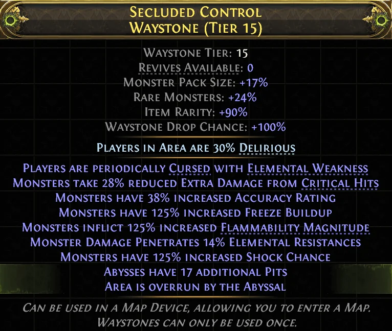
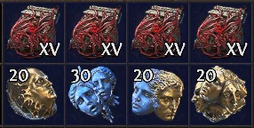
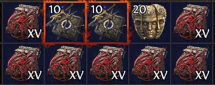
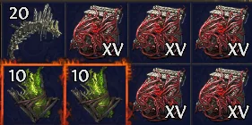
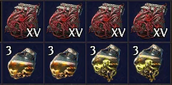
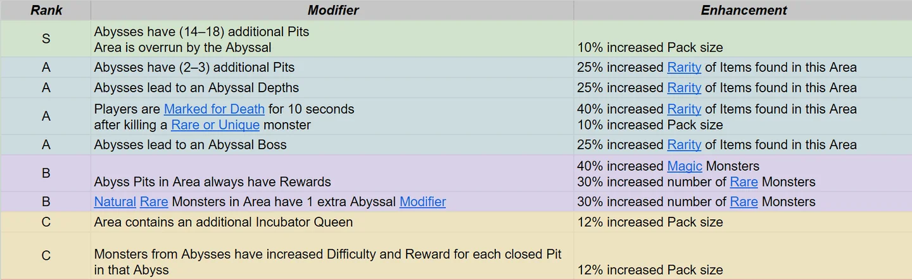

Có một nghề ở endgame _Path of Exile 2_ mà ít anh em để ý: **craft Waystone để bán**. **Ignatius** làm nghề này ra tấm ra món — mỗi viên bán được **2 tới 4 Divine** tuỳ roll, trong khi vốn bỏ ra chỉ khoảng **73 Exalt**. Trời ơi hot quá nè mấy pa, để Cenix kể cho nghe.

<strong>Hướng của cả bài:</strong> Waystone bán được giá là Waystone nhắm vào <strong>Rarity</strong> và <strong>mod Abyss</strong> — không phải Pack Size. Nhớ kỹ chỗ này, Cenix sẽ nói lại ở cuối bài.

## Vốn bỏ ra — khoảng 73 Exalt một viên

| Khoản | Chi phí |
|---|---|
| Đẩy đủ affix | **3 Exalt** |
| Omen of Chaotic Rarity | **26 Exalt** |
| Omen of Sinistral Necromancy | **21 Exalt** |
| Chaos Orb | **12 Exalt** |
| Preserved Vertebrae | **2 Exalt** |
| Liquid Paranoia | **9 Exalt** |
| **Tổng** | **~73 Exalt** |

Ignatius quy đổi cho dễ nhớ:

> Cứ **5 viên Waystone** là tốn khoảng **1 Divine**.

## Năm bước craft

### Bước 1 — Đẩy đủ 6 affix

Dùng **Alchemy**, **Augmentation**, **Regal** và **Exalt** để đẩy lên **đủ 6 affix mỗi phe**. Đừng mất công ngồi đếm mod trước khi sang bước 2 — Ignatius nói thẳng là phí thời gian.

### Bước 2 — Ép hướng Rarity

Dùng **Omen of Chaotic Rarity** kèm **Chaos Orb** để reroll affix theo hướng bonus rarity. Đây là bước tốn tiền nhất (26 Exalt) nhưng cũng là bước quyết định giá bán.

### Bước 3 — Thêm mod Abyss

Dùng **Omen of Sinistral Necromancy** kèm **Preserved Vertebrae** để thêm mod abyss chưa lộ, rồi mang tới **Well of Souls** để lộ mod.

### Bước 4 — Bôi Liquid Paranoia

Bôi **Liquid Paranoia ba lần** để thêm % quái Rare. Bán hay tự chạy đều làm bước này.

### Bước 5 — Vaal (tuỳ chọn)

Viên nào ra mod abyss **tier C trở xuống** thì cứ **Vaal** cho corrupt, coi như đánh bạc gỡ lại. Đằng nào cũng khó bán.

## Tier list mod Abyss

Ignatius có một điều đáng chú ý về cách sắp xếp:

> Gần như toàn bộ mod ngon đều nằm ở phe **prefix**.

Bảng xếp hạng đầy đủ nằm trong tấm hình trên và trong bảng tính ông chia sẻ ở bài gốc — Cenix để nguyên ảnh cho anh em soi, vì danh sách khá dài và Ignatius có cập nhật theo bản vá.

## Định giá thế nào cho khỏi hớ

-   Viên nào có mod abyss **tier B** trở lên: bán tối thiểu **40 Exalt**.

-   Viên **tier S** dính mod **Overrun**: hét **100 Exalt** trước, mỗi ngày không ai mua thì **hạ 20 Exalt**.

<strong>Cái bẫy lớn nhất — Pack Size:</strong> Ignatius gọi thẳng Pack Size là <strong>"mồi nhử"</strong>. Nghe thì mê vì tưởng nhiều quái là nhiều đồ, nhưng thứ thật sự ra tiền là <strong>mod quái Rare</strong> và <strong>Rarity</strong>. Đừng đổ currency vào roll Pack Size.

## Tóm gọn cho ông nào lười đọc

-   Vốn **~73 Exalt/viên**, bán được **2–4 Divine**. Cứ 5 viên tốn 1 Divine tiền vốn.

-   Năm bước: đẩy đủ affix → **Chaotic Rarity** → **Sinistral Necromancy + Preserved Vertebrae** rồi lộ ở Well of Souls → **Liquid Paranoia x3** → Vaal mấy viên tier C.

-   Mod abyss ngon gần như đều là **prefix**.

-   Tier B trở lên bán từ **40 Exalt**; tier S "Overrun" hét **100 Exalt** rồi hạ dần **20 Exalt/ngày**.

-   **Pack Size là mồi nhử** — nhắm quái Rare và Rarity.

Một khi đã máu thì đừng hỏi bố cháu là ai nữa — nhưng nghề này thì nên tính toán chứ đừng máu, vì mỗi viên hỏng là bay gần 1/5 Divine. Anh em có ai đang craft Waystone bán chưa, lời lỗ thế nào? Kể Cenix nghe với.

*Nguồn tham khảo: [Mobalytics — Ignatius](https://mobalytics.gg/poe-2/guides/waystone-abyss-modifier-tier-list)*
