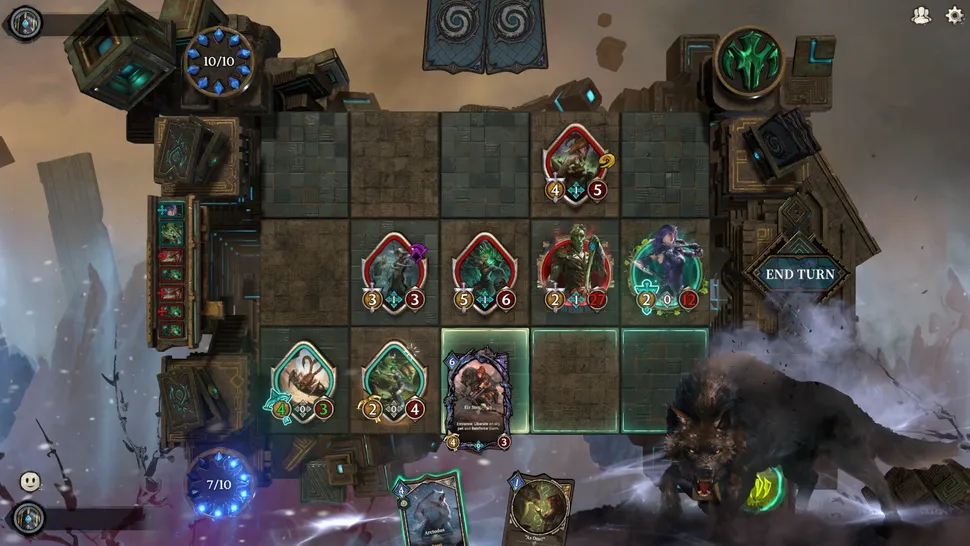

Cuộc chiến trực tuyến bất tận của Guild Wars sắp sửa vượt ra khỏi ranh giới của thể loại MMO. Chỉ mới công bố Guild Wars 3 hồi đầu tháng này, ArenaNet và công ty mẹ NC đã tiết lộ rằng họ cũng sẽ đưa series này vào một thể loại hoàn toàn mới, thông qua một trò chơi thẻ bài Guild Wars chính thức có tên là Mistbound.

Mistbound được ArenaNet cấp phép và được NC phát triển với sự tham gia của bilibili – nền tảng tương đương YouTube của Trung Quốc. "Chúng tôi cảm thấy đã đến lúc mang đến cho người hâm mộ Guild Wars một cách chơi mới, lấy cảm hứng từ nguồn gốc trò chơi thẻ bài của thương hiệu, nơi họ có thể cạnh tranh trong một đấu trường PvP trong không gian trò chơi thẻ bài sưu tầm (CCG)", người đứng đầu studio ArenaNet, Colin Johanson, cho biết trong một tuyên bố. "Mang đến tất cả những trải nghiệm mà họ yêu thích về các nhân vật, sinh vật và âm thanh của thế giới Tyria vào cuộc sống trong CCG." "Nguồn gốc trò chơi thẻ bài" mà Johanson đề cập đến là việc Guild Wars được lấy cảm hứng từ Magic: The Gathering, cụ thể là cách các thuộc tính nhân vật có thể được sửa đổi để tạo ra các lối chơi riêng biệt.

Điểm khác biệt của Mistbound so với công thức CCG kỹ thuật số về cơ bản là cung cấp cho bạn những lá bài có thể di chuyển được. Điểm nổi bật chính của trò chơi là lưới chiến thuật 5x3 năng động, nơi các đơn vị và chỉ huy—được triển khai dưới dạng thẻ bài—có thể di chuyển vị trí từng lượt để phản ứng với chuyển động của kẻ địch.

Rõ ràng, hệ thống này—mà NC gọi là "lối chơi di chuyển năng động"—nhằm mục đích làm cho sự phức tạp vốn có của một trò chơi thẻ bài như Magic trở nên trực quan hơn một chút.

"Một thách thức khi theo đuổi những chiến thuật kết hợp sâu sắc trong các trò chơi thẻ bài là bản thân các lá bài rất dễ trở nên quá phức tạp," nhà sản xuất Hwang Sunwoo của Mistbound cho biết. "Thay vì đặt sự phức tạp đó lên từng lá bài riêng lẻ, chúng tôi muốn thể hiện điều đó thông qua chiến trường."

During battle, players will be able to exploit numerous mechanics like knockbacks, pulls and flanking. Alongside standard units, familiar Guild Wars characters can step onto the battlefield as commanders, bringing unique abilities and tactics for you to take advantage of. You can also expect a soundtrack with contributions from Guild Wars' original musicians, and voice performances for all those Guild Wars regulars.

Góc nhìn từ Bilibili dường như tập trung vào khía cạnh phát triển cộng đồng. Thông cáo báo chí cho biết việc phát triển Mistbound không chỉ được định hướng bởi kiến ​​thức thiết kế của nhà phát triển mà còn bởi "phản hồi trực tiếp, chất lượng cao từ người chơi". Tôi cũng cho rằng NC đang tìm cách xây dựng một lượng người chơi cho Mistbound ngoài trò chơi, có thể với mục tiêu biến nó thành một môn thể thao điện tử giống như Hearthstone. Hiện vẫn chưa có ngày phát hành chính thức cho Mistbound, nhưng tôi nghi ngờ nó sẽ ra mắt trước cuối năm nay, và rất có thể chúng ta sẽ thấy nó vào năm 2027.